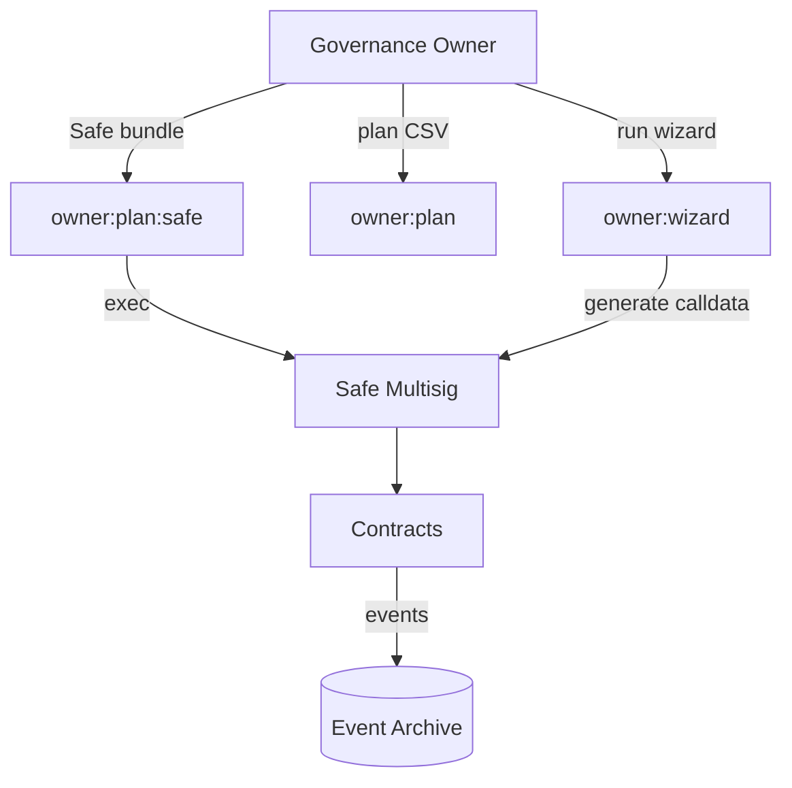

# AGI Jobs v2 Institutional Deployment Blueprint

> **Audience:** Contract owners, governance stewards, and program managers shipping AGI Jobs v2 in a production-critical environment with minimal engineering lift.
> **Goal:** Deliver a repeatable, auditor-friendly launch sequence where non-technical operators can deploy, validate, and operate the protocol with full owner control.

---

## 0. Systems map at a glance

```mermaid
flowchart LR
    subgraph Source Control
        A[Developer PR]
    end
    subgraph CI Suite
        B[ci (v2) summary]\nPulls jobs listed below
        B1[Lint & Static]
        B2[Tests + Coverage]
        B3[Foundry Fuzz]
        B4[Contracts ABI Drift]
        B5[E2E + Web UIs]
    end
    subgraph Governance Vault
        C[Owner Plan CSV]
        D[Safe Bundle]
    end
    subgraph Production Ops
        E[Truffle Wizard]
        F[Etherscan Write Tabs]
        G[SystemPause Console]
    end

    A --> B
    B -->|Status checks| PR{Branch Protection}
    PR -->|Green| Merge[Main Branch]
    Merge -->|Artifacts| E
    E -->|Addresses| C
    C -->|Reviewed| D
    D -->|Execute| F
    Merge -->|Config Sync| G
```

- **Always gate PR merges** on the green `ci (v2)` summary status. Branch protection should require this check; see [docs/BRANCH_PROTECTION.md](../BRANCH_PROTECTION.md).
- **Owner tooling** produces both a CSV plan and a Safe Transaction Builder bundle, ensuring every change is rehearsed before execution.
- **Deployment** can occur via the Truffle wizard or the browser-only Etherscan workflow; both paths converge on the same module wiring.

---

## 1. Pre-flight validation stack (triple verification)

| Check | Purpose | Command (non-destructive) | Independent cross-check |
| --- | --- | --- | --- |
| Configuration & secrets | Ensure `.env` and deployment JSON are consistent | `env DOTENV_PATH=.env npm run deploy:checklist` | Open `deployment-config/mainnet.json` in GitHub Codespaces viewer and have a reviewer tick through the generated diff |
| Token metadata | Prevent $AGIALPHA mismatch | `npm run verify:agialpha -- --rpc https://` | Query token contract on Etherscan → **Token Tracker** tab (symbol/decimals) |
| ENS roots | Confirm namehashes for `agent.agi.eth` / `club.agi.eth` | `npm run namehash:mainnet` | Run [ens.domains app](https://app.ens.domains) → Advanced → `Copy Namehash` |
| Owner readiness | Guarantee governance can mutate every knob | `npm run owner:health` | Load generated `reports/<network>-owner-audit.md` and review with governance signer |
| Module wiring | Prevent dangling module references | `npm run wire:verify -- --network mainnet` | Inspect `Deployer.summarize()` output via Etherscan `read` tab |

> **Tip:** Maintain screenshots of each verification step in the ops vault. Auditors expect both the CLI output and the external confirmation.

---

## 2. CI enforcement for a fully green v2 pipeline

1. Open **Repository Settings → Branches → Branch protection rules → Edit `main`**.
2. Require the status checks enumerated in [docs/BRANCH_PROTECTION.md](../BRANCH_PROTECTION.md) (exact strings from the Checks tab) together with the companion workflows listed there.
3. Enable **Require branches to be up to date before merging** so rebases pick up the latest Solidity constants.
4. Enable **Require approvals** (min 1 CODEOWNER), **Require signed commits**, **Restrict force pushes**, and **Require linear history** for auditability.
5. Mirror the same rule to long-lived release branches (e.g., `release/v2`) if you cut staging builds. Run `gh api repos/:owner/:repo/branches/<branch>/protection --jq '{checks: .required_status_checks.contexts}'` after saving each rule to confirm the contexts above are present.

> 💡 **Optional reviewer UX:** Install the GitHub Checks "Required Status" dashboard in the project board to highlight the `ci (v2)` badge. Non-technical reviewers only need to track the single ✅ indicator while engineers can drill into the fan-out jobs as needed.

---

## 3. Deployment paths (choose your adventure)

### 3.1 Guided CLI (Truffle Wizard)

1. `npm install` (first run only).
2. `export GOVERNANCE_ADDRESS=0xYourSafe` and `export DOTENV_PATH=.env`.
3. Dry run: `npm run migrate:wizard -- --network mainnet`.
4. Execute: `npm run migrate:wizard -- --network mainnet --execute`.
5. Capture the emitted addresses and store them in your encrypted vault under "AGI Jobs v2 – Deployment".
6. Immediately run `npm run owner:plan > owner-plan.csv` and `npm run owner:plan:safe`.
7. Have the governance signer review `owner-plan.csv`, then load `owner-safe-bundle.json` into [Safe Transaction Builder](https://app.safe.global/transactions/builder) and sign.

### 3.2 Browser-only (Etherscan)

1. Print the [Non-Technical Mainnet Deployment Runbook](nontechnical-mainnet-deployment.md).
2. Walk through `Section 1–6` sequentially, checking off each item.
3. Use the `Write Contract` tab for each module in the order defined in the runbook. Keep the zero address placeholder until dependencies exist.
4. After deployment, call the post-deploy setters (`setValidationModule`, `setFeePool`, etc.) via Etherscan **Write** tabs or the `owner:wizard` CLI (dry-run first).
5. Verify source code for each contract to unlock the ABI UI (Truffle wizard can emit flattened sources if required).
6. Upload the Safe bundle from the CLI workflow to execute economic parameter changes from a hardware wallet.

Both paths **must** converge by running `npm run owner:doctor -- --network mainnet --strict` and `npm run wire:verify -- --network mainnet` afterwards. Treat any discrepancy as a red stop sign.

---

## 4. Owner control surface (complete authority checklist)



| Action | CLI command | Browser fallback | Notes |
| --- | --- | --- | --- |
| Adjust protocol fee | `npm run owner:wizard` → `JobRegistry fee` | Etherscan → JobRegistry `setFeePct` | Wizard outputs calldata preview before submission |
| Update burn percentage | `npm run owner:wizard` → `FeePool burn` | Etherscan → FeePool `setBurnPct` | Requires prior allowlist for treasury change |
| Rotate SystemPause operator | `npm run owner:wizard` → `SystemPause operators` | Etherscan → SystemPause `setOperator` | Execute during maintenance window |
| Add treasury allowlist entry | `npm run owner:plan -- --component StakeManager` | Etherscan → StakeManager `setTreasuryAllowlist` | CLI prints diff and zipped evidence |
| Update validator bounds | `npm run owner:wizard` → `ValidationModule committee` | Etherscan → ValidationModule `setValidatorBounds` | Commit/reveal windows should be reviewed simultaneously |

> **Immutable guardrails:** Setter functions revert unless called by the owner. Keep owner keys in a hardware wallet or Safe; never leave them on hot wallets.

---

## 5. Final go-live rehearsal (institutional sign-off)

1. **Fork rehearsal** – `npm run simulate:v2` to execute the scripted end-to-end job lifecycle on an anvil fork. Export gas reports into `reports/fork-<date>.json`.
2. **Testnet dress rehearsal** – Use Goerli/Sepolia configuration to mirror the mainnet plan. Capture the resulting addresses and share them with auditors.
3. **Pause drill** – From the governance account, run `npm run pause:test -- --network mainnet --json > reports/mainnet-pause-verification.json` to record the simulated pause/unpause capability report. Attach both the console log and JSON artefact to the change ticket.
4. **Economics cross-check** – Compare `config/thermodynamics.json` against on-chain values via `THERMO_REPORT_FORMAT=markdown THERMO_REPORT_OUT=reports/mainnet-thermodynamics.md npm run thermodynamics:report -- --network mainnet`. Share the resulting Markdown with finance/compliance and archive the JSON/Markdown artefact in the ticket. Repeat with `THERMO_REPORT_FORMAT=json` when auditors request machine-readable evidence.
5. **Launch sign-off** – Compile a single PDF containing:
   - CI summary screenshot (`ci (v2)` green run).
   - Fork + testnet rehearsal logs.
   - Owner plan CSV and Safe bundle hash.
   - Pause drill transcript.
   - Contact sheet for owner, pauser, operations, and auditor.

Only after all stakeholders sign this packet should the owner publish the "Go Live" announcement.

---

## 6. Non-technical quick reference

| Scenario | How to respond | Evidence to capture |
| --- | --- | --- |
| Need to adjust job fee | Run `owner:wizard` or Etherscan `setFeePct` | Screenshot of wizard diff + Safe transaction hash |
| Validator outage | Use `SystemPause.pauseValidation()` → run `owner:plan` for committee rotation | Pause tx hash + new validator list |
| Treasury update | `owner:plan` → `owner:plan:safe` → Safe execution | Safe execution hash + updated config JSON |
| Emergency halt | Call `SystemPause.triggerGlobalPause()` | Event log screenshot + operations runbook entry |
| Resume operations | `SystemPause.releaseGlobalPause()` after remediation | Safe execution hash + incident review notes |

Keep this table laminated in the operations war room or pinned in your collaboration tool.

---

## 7. Continuous compliance

- Schedule a **monthly** run of `npm run owner:audit -- --network mainnet --out reports/mainnet-owner-audit-<date>.md`.
- After every parameter change, re-run `npm run wire:verify` and archive the output.
- Use GitHub scheduled workflows (`.github/workflows/release.yml`) to perform nightly dry runs; review failures the next morning.
- Rotate secrets quarterly; document the process in `owner-control-change-ticket.md`.
- Maintain an off-site backup of the `deployment-config/*.json` files and Safe bundles.

---

### Where to go next

- [Non-technical mainnet deployment runbook](nontechnical-mainnet-deployment.md)
- [AGI Jobs v2 sprint plan and deployment guide](../agi-jobs-v2-production-deployment-guide.md)
- [Production deployment handbook](../production-deployment-handbook.md)
- [Owner control atlas](../owner-control-atlas.md) for a graphical view of every privileged function.
- [Green-path checklist](../green-path-checklist.md) to double-check operational readiness.

