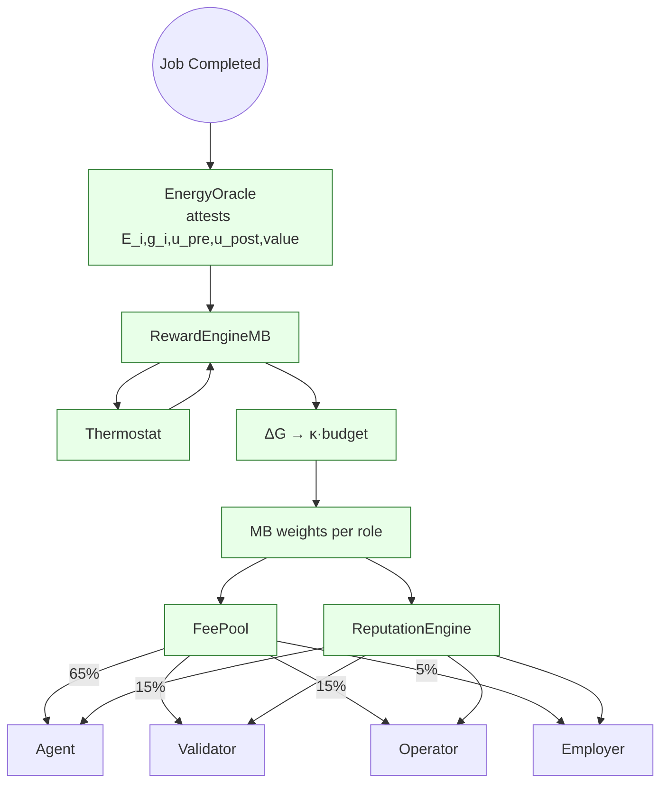
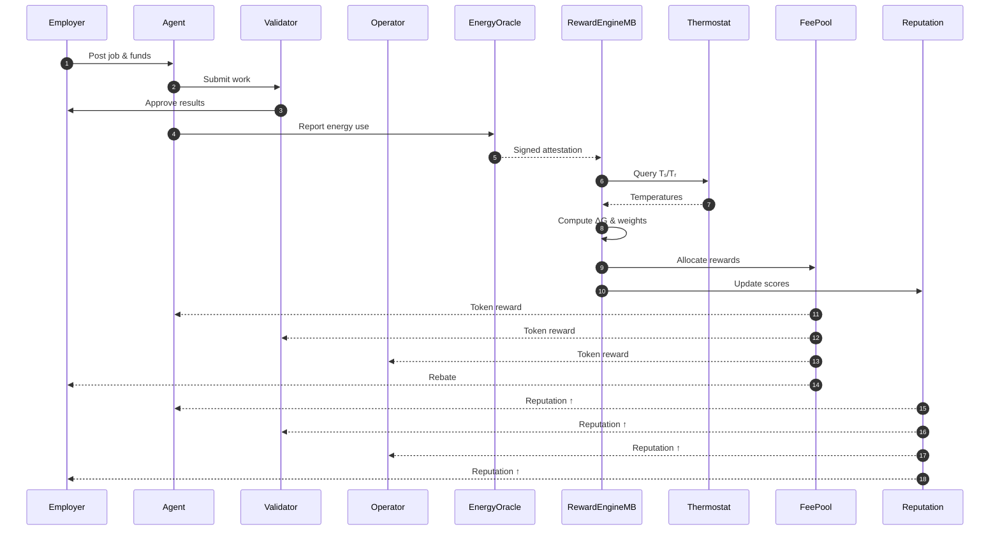

# Reward Settlement Process

The reward engine settles each epoch by converting reduced free energy into tokens and reputation. The diagrams below illustrate the end-to-end flow from job completion to payouts.

## Free-Energy Flow

## Settlement Sequence

