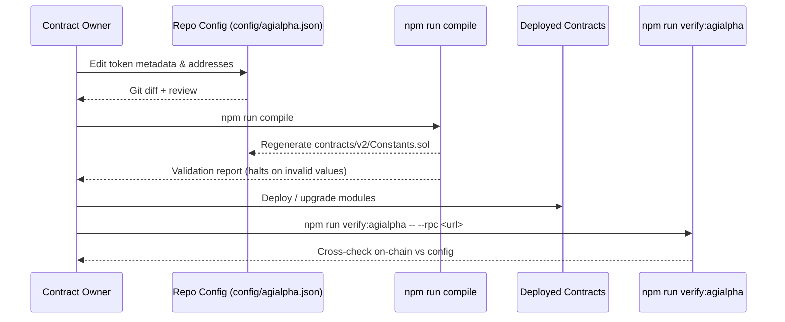
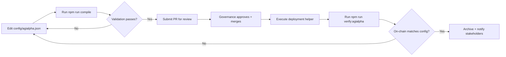

# Token Operations Control Guide

This guide gives the contract owner and non-technical operators a repeatable,
auditable playbook for updating the `$AGIALPHA` token constants that feed every
Solidity module and TypeScript client. Follow the flow to change token metadata,
addresses or scaling constants with zero downtime and guaranteed verification.



## At-a-glance responsibilities

| Role | Focus | Key tooling |
| ---- | ----- | ----------- |
| Contract owner | Approves configuration changes and signs deployments. | Governance multisig / timelock, `npm run owner:parameters`. |
| Operations lead | Edits `config/agialpha.json`, runs compilation + verification. | VS Code or JSON editor, `npm run compile`, `npm run verify:agialpha`. |
| Observability | Confirms runtime monitoring & dashboards reflect new token info. | Grafana dashboards, `scripts/v2/updateThermodynamics.ts` dry runs. |

## Prerequisites

- Node.js 20.19.0 and npm 10+ (run `nvm use` from the repo root).
- Access to the governance signer capable of executing deployments.
- RPC endpoint for the target network with archive or full-node access for
  verification (HTTPS or WebSocket).
- Clean working tree with no uncommitted changes before starting the process.

## Configuration primer

The canonical token metadata lives in `config/agialpha.json`. It contains:

```jsonc
{
  "address": "0x...",         // Canonical ERC-20 deployment
  "symbol": "AGIALPHA",        // Up to 11 characters
  "name": "AGI Alpha Token",   // Display name
  "decimals": 18,               // Integer 0–255
  "burnAddress": "0x...",      // Optional burn sink (non-zero)
  "scalingFactor": "1000000000000000000" // bigint string used by rewards
}
```

> **Immutable reminder:** The contracts assume the token address never
> changes after production launch. Update the metadata only for new networks
> or emergency redeployments that migrate all dependent balances.

## Update workflow (non-technical edition)

1. **Plan the change**
   - Run `npm run owner:parameters -- --format human` to grab the current
     token section for your records.
   - Confirm upstream stakeholders (treasury, accounting, rewards ops) are
     aware of the new metadata.

2. **Edit the configuration**
   - Open `config/agialpha.json` in a JSON-aware editor.
   - Update only the fields that changed (address, metadata, burn sink,
     scaling factor). Keep the JSON strictly formatted; trailing commas are
     invalid.
   - Save the file and run `git diff config/agialpha.json` to review changes.

3. **Regenerate constants**
   - Execute `npm run compile`.
   - The helper validates:
     - Addresses are 20 bytes and non-zero (except burn if intentionally zero).
     - Symbol, name and decimals match ERC-20 constraints.
     - Scaling factor parses as a bigint.
   - If validation fails, correct the JSON and rerun the command.

4. **Verify regenerated artifacts**
   - Inspect `contracts/v2/Constants.sol` to confirm the emitted values.
   - Stage the JSON + Solidity changes (`git add config/agialpha.json contracts/v2/Constants.sol`).

5. **Deploy / promote**
   - Use the appropriate deployment helper (for example
     `npx hardhat run scripts/v2/deployDefaults.ts --network <network>`).
   - Ensure every module depending on the constants is redeployed or upgraded.

6. **Post-deployment verification**
   - Run `npm run verify:agialpha -- --rpc https://...` using an endpoint that
     exposes the final chain state.
   - The script fetches the ERC-20 metadata from the blockchain and compares it
     against `config/agialpha.json` and `contracts/v2/Constants.sol`. It exits
     non-zero if any field diverges.
   - Archive the verification output with the governance ticket.

7. **Broadcast update**
   - Notify dependent teams (staking, treasury, analytics) with the new token
     metadata and links to the verification artefacts.

## Governance checkpoints



## Zero-downtime checklist

- [ ] New token address funded and fully synced before switching consumers.
- [ ] All relayers, paymasters and reward engines reconfigured to the new address.
- [ ] Off-chain services (indexers, analytics, dashboards) updated to expect the
      revised symbol/name.
- [ ] Governance and treasury sign-off documented with links to the verification
      output and git commit.

## Troubleshooting

| Symptom | Likely cause | Resolution |
| ------- | ------------ | ---------- |
| `npm run compile` rejects the config with `Invalid address length`. | Address missing `0x` prefix or not 40 hex chars. | Re-enter the address; use checksum casing to avoid typos. |
| `verify:agialpha` reports decimal mismatch. | On-chain token decimals differ from config. | Double-check the live token contract; update config and rerun compile. |
| Deployments still point to the old token. | Dependent modules not redeployed. | Re-run the deployment helper with `--execute` after staging the new constants. |

## Reference material

- [docs/owner-parameter-matrix.md](owner-parameter-matrix.md)
- [docs/thermodynamic-incentives.md](thermodynamic-incentives.md)
- [docs/reward-settlement-process.md](reward-settlement-process.md)
- [docs/owner-control-command-center.md](owner-control-command-center.md)

By following this guide, the contract owner retains complete control over the
token parameters that drive the AGI Jobs platform while preserving a verifiable,
production-ready audit trail.
