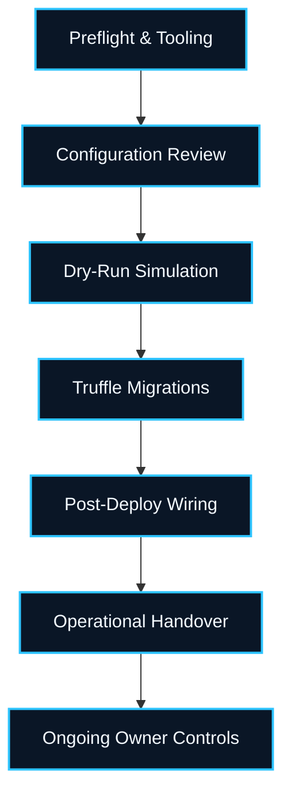
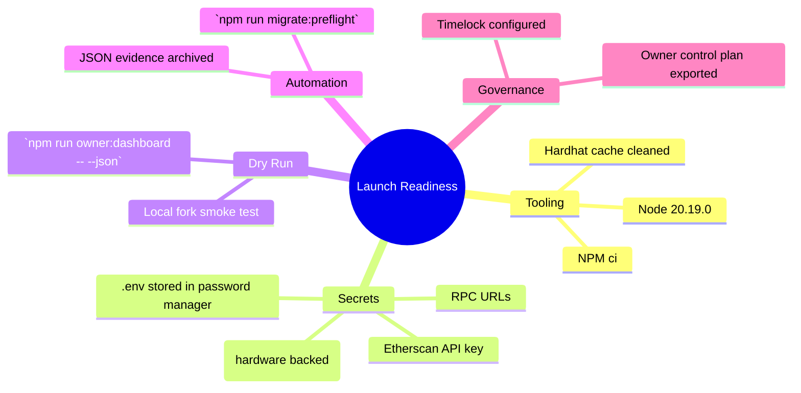
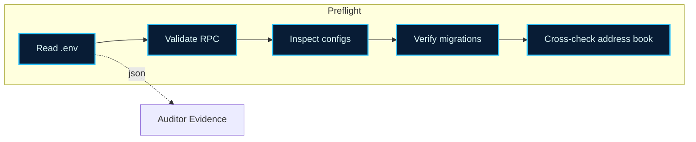
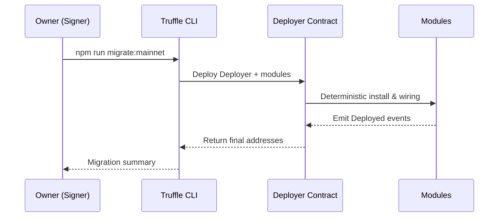
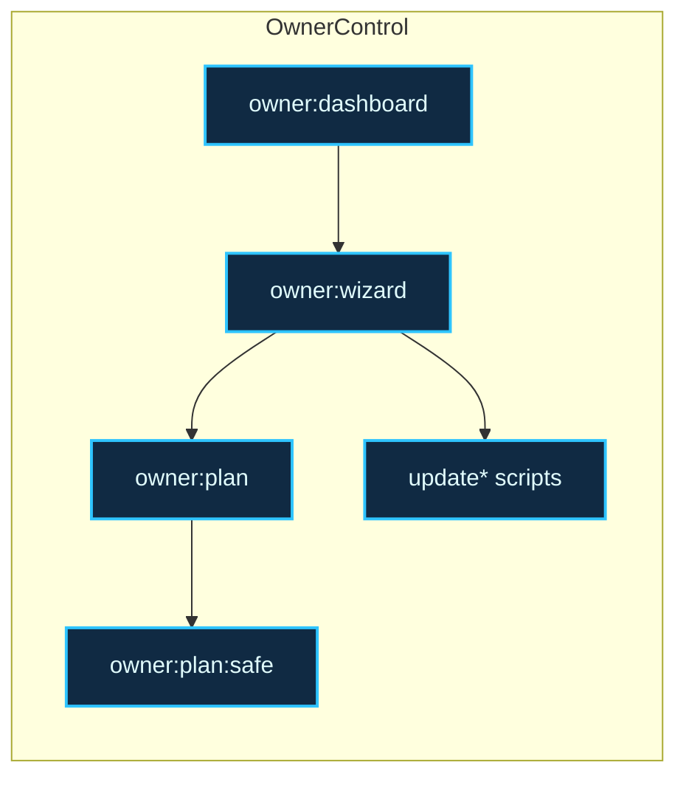

# AGIJobs v0 – Institutional Truffle Mainnet Playbook

> **Purpose**: give a non-technical launch coordinator a safe, repeatable and audit-friendly recipe to deploy the AGIJobs protocol to Ethereum Mainnet using Truffle, with built-in owner controls, validation tooling and governance hand-off guardrails.

## 1. Mission Control Overview



## 2. Preflight Checklist

| Item                | Command / Action                                   | Notes |
| ------------------- | -------------------------------------------------- | ----- |
| Node.js 20.19.0     | `node -v`                                          | Matches the pinned CI/runtime version |
| NPM clean install   | `npm ci`                                           | Must be run from repo root |
| Automated preflight | `npm run migrate:preflight -- --network mainnet`   | Runs 40+ deterministic checks (use `--json` for export) |
| Environment secrets | `.env`                                             | See §3.1 for template |
| RPC connectivity    | `curl $MAINNET_RPC_URL`                            | Ensure 200 OK JSON-RPC response |
| Etherscan API       | `ETHERSCAN_API_KEY`                                | Needed for automatic verification |
| Address book        | `docs/deployment-addresses.json`                   | Populate with final module addresses post-deploy |
| Governance signer   | multisig / timelock                                | Confirm hardware wallet + Safe access |



### 2.1 Automated Preflight CLI



Run the institutional-grade lint prior to every rehearsal and production cutover:

```bash
# Defaults to TRUFFLE_NETWORK (falls back to mainnet)
npm run migrate:preflight -- --network mainnet

# Produce machine-readable evidence for auditors
npm run migrate:preflight -- --network mainnet --json > preflight.mainnet.json
```

The preflight script loads every protocol config (`agialpha`, stake/job registries, tax policy, ENS roots), sanity-checks the Truffle migration bundle, exercises the RPC endpoint, and confirms the owner control playbooks are reachable. Any ❌ failures must be resolved before continuing.

## 3. Configuration for Mainnet

### 3.1. Environment variables (`.env`)

Create `./.env` (never commit it):

```ini
MAINNET_PRIVATE_KEY=0xYOUR_PRODUCTION_SIGNER_PRIVATE_KEY
MAINNET_RPC_URL=https://mainnet.infura.io/v3/YOUR_PROJECT_ID
ETHERSCAN_API_KEY=your_etherscan_key
AGIALPHA_TOKEN=0xA61a3B3a130a9c20768EEBF97E21515A6046a1fA
# Optional governance overrides
GOVERNANCE_ADDRESS=0xYourTimelockOrSafe
FEE_PCT=5
BURN_PCT=5
```

For Sepolia rehearsals, also set `SEPOLIA_PRIVATE_KEY` and `SEPOLIA_RPC_URL`.

### 3.2. Canonical configuration files

1. Review `config/agialpha.mainnet.json`, `config/ens.mainnet.json`, `config/stake-manager.json`, `config/fee-pool.json`, `config/job-registry.json`, `config/platform-registry.json`, `config/platform-incentives.json`, `config/tax-policy.json`, and `deployment-config/mainnet.json`.
2. Run the interactive owner wizard to confirm thresholds:
   ```bash
   npm run owner:wizard -- --network mainnet
   ```
3. Capture a governance plan for review:
   ```bash
   npm run owner:plan -- --network mainnet --json --out owner-plan.mainnet.json
   ```
4. If the plan must be executed via Safe, pre-generate the bundle:
   ```bash
   npm run owner:plan:safe
   ```

## 4. Dry-run Simulation (strongly recommended)

```bash
# Reset local artifacts
rm -rf cache artifacts

# Spin up a fork (Anvil or Ganache)
npx hardhat node --fork $MAINNET_RPC_URL --no-deploy &
sleep 5

# Deploy against the fork
TRUFFLE_NETWORK=mainnet MAINNET_RPC_URL=http://127.0.0.1:8545 \
  MAINNET_PRIVATE_KEY=0x.... npm run migrate:mainnet

# Inspect resulting state
npm run owner:dashboard -- --config-network mainnet --json > fork-dashboard.json
```

Review `fork-dashboard.json` to confirm every module points to the expected governance, treasury and cross-module wiring.

## 5. Production Deployment Steps



1. **Install dependencies (fresh machine each run):**
   ```bash
   npm ci
   ```
2. **Compile with deterministic constants:**
   ```bash
   npm run compile:mainnet
   ```
3. **Execute the full migration bundle (after a clean `npm run migrate:preflight` pass):**
   ```bash
   npm run migrate:mainnet
   ```
   Internally this performs:
   - `1_initial_migration.js`
   - `2_deploy_protocol.js` (deploys `Deployer`)
   - `3_wire_protocol.js` (installs modules + economic parameters)
   - `4_configure_ens.js`
   - `5_transfer_ownership.js`
4. **Record addresses:** after the run, update `docs/deployment-addresses.json` with the emitted addresses (the script auto-writes; verify contents then commit in a secure PR).
5. **Verify wiring + owner controls on-chain:**
   ```bash
   npm run owner:dashboard -- --config-network mainnet
   npm run wire:verify
   npm run owner:health
   ```
6. **Publish Safe execution bundle (if applicable):** review `owner-safe-bundle.json` (generated by `owner:plan:safe`) and upload to the Safe transaction service.

## 6. Post-Deployment Tasks

| Task                   | Command                                                                                   | Purpose                            |
| ---------------------- | ----------------------------------------------------------------------------------------- | ---------------------------------- |
| Etherscan verification | `npm run wire:verify`                                                                     | Confirms ABI metadata + ENS wiring |
| Coverage regression    | `npm run coverage:report`                                                                 | Optional attestation for auditors  |
| Slither & Echidna      | GitHub CI                                                                                 | Ensure badges remain green         |
| Update runbook         | Commit updated `docs/deployment-addresses.json` + `CHANGELOG.md`                          | Institutional traceability         |
| Archive artifacts      | Securely store `owner-plan.mainnet.json`, `owner-safe-bundle.json`, `fork-dashboard.json` | Future audits                      |

## 7. Owner Control Toolkit

The following scripts give the owner full operational control post-launch:

| Script                            | Description                                                                                                |
| --------------------------------- | ---------------------------------------------------------------------------------------------------------- |
| `npm run owner:dashboard`         | Human-readable module status (governance, treasury, thresholds) + JSON export via `--json`.                |
| `npm run owner:wizard`            | Guided CLI to adjust economic parameters and regenerate configs.                                           |
| `npm run owner:plan`              | Generates a governance execution plan; add `--execute` to apply instantly (use only with extreme caution). |
| `npm run owner:plan:safe`         | Produces a Safe Transaction Service bundle (`owner-safe-bundle.json`).                                     |
| `npm run updateStakeManager` etc. | Fine-grained module updaters located in `scripts/v2/`.                                                     |



### 7.1. Example owner healthcheck procedure

```bash
# 1. Snapshot live state
npm run owner:dashboard -- --config-network mainnet --json > live-dashboard.json

# 2. Generate recommended actions
npm run owner:plan -- --network mainnet --out live-owner-plan.json

# 3. Execute adjustments (Safe-first)
npm run owner:plan:safe
# Review & execute in Safe UI with required signers
```

## 8. Troubleshooting Matrix

| Symptom                                | Diagnosis                          | Resolution                                                                      |
| -------------------------------------- | ---------------------------------- | ------------------------------------------------------------------------------- |
| `Missing private key` during migration | `.env` not loaded                  | Confirm `.env` is present and `MAINNET_PRIVATE_KEY` is non-zero hex             |
| `AGIALPHA token mismatch`              | Config vs deployment plan mismatch | Align `config/agialpha.mainnet.json` and `deployment-config/mainnet.json`       |
| `Governance contract missing`          | `GOVERNANCE_ADDRESS` not provided  | Export Safe/Timelock address and rerun `npm run migrate:mainnet`                |
| `wire:verify` failure                  | RPC 404 or wrong chain             | Ensure `WIRE_VERIFY_RPC_URL` points to a synced node (default Ganache on :8545) |
| Owner dashboard errors                 | Module artifacts missing           | Run `npm run compile` to refresh ABIs                                           |

## 9. Institutional Governance Commitments

- Always run the Sepolia rehearsal (`npm run migrate:sepolia`) before mainnet.
- Require dual-control (at least two reviewers) for config changes and address book updates.
- Store signed JSON artifacts (`owner-plan*.json`, `owner-safe-bundle.json`) in an encrypted vault.
- Keep GitHub Actions CI green; re-run `CI` workflow whenever dependencies change.

## 10. Quick Reference Commands

```bash
npm ci                                   # clean install
npm run migrate:preflight                # deterministic preflight inspection
npm run compile:mainnet                  # compile + generate constants
npm run migrate:mainnet                  # full mainnet deployment via Truffle
npm run wire:verify                      # ENS + wiring validation
npm run owner:dashboard -- --json        # governance status snapshot
npm run owner:plan:safe                  # Safe bundle for governance updates
```

Stay disciplined: execute the checklist, store artifacts securely, and never skip rehearsals. This playbook keeps mainnet launches deterministic, reviewable and owner-friendly.
