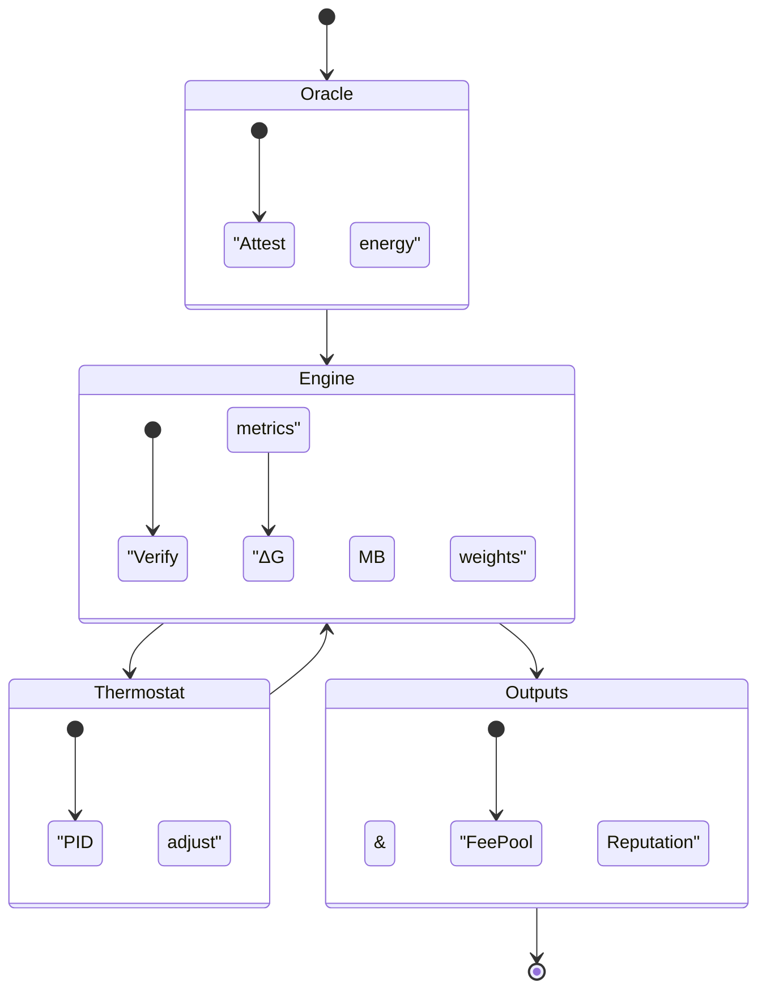
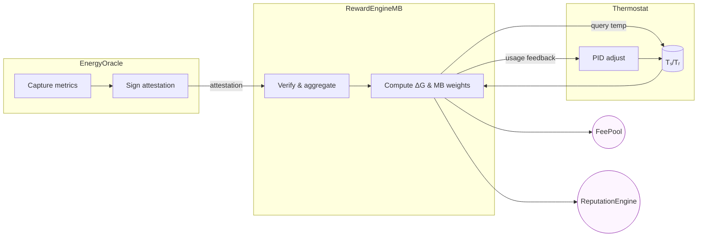
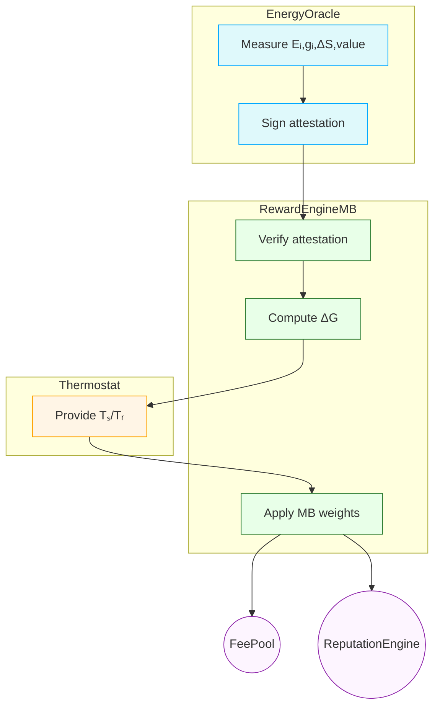
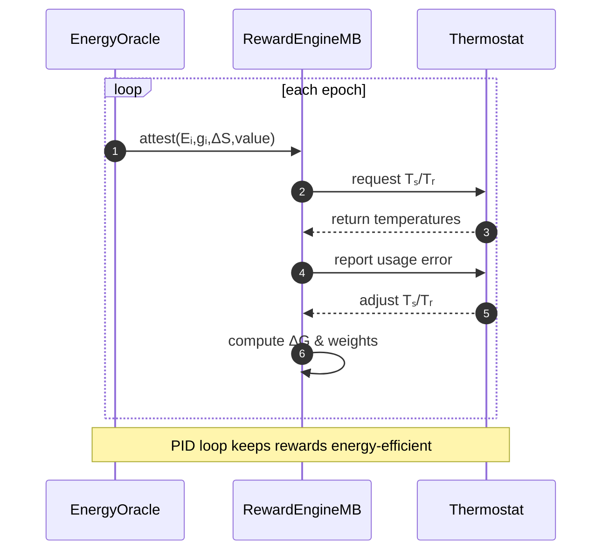
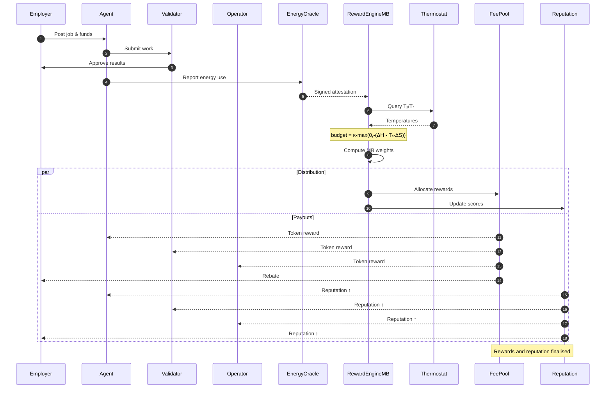

# Universal Platform Incentive Architecture

The AGI Jobs v2 suite implements a single, stake‑based framework that treats the main deployer and third‑party operators under the same rules. Every value transfer occurs on‑chain in the 18‑decimal **$AGIALPHA** token.

## Roles

| Role              | StakeManager enum | Purpose                                              |
| ----------------- | ----------------- | ---------------------------------------------------- |
| Employer          | n/a               | Posts jobs and escrows rewards.                      |
| Agent             | `0`               | Completes jobs.                                      |
| Validator         | `1`               | Audits and finalises jobs.                           |
| Platform Operator | `2`               | Hosts an AGI Jobs portal and receives protocol fees. |

## Core Modules

- **AGIALPHAToken** – 18‑decimal ERC‑20 used for staking, rewards and dispute bonds. The production `$AGIALPHA` token lives outside this repository; [`AGIALPHAToken.sol`](../contracts/test/AGIALPHAToken.sol) is provided only for local testing.
- **StakeManager** – records stakes for all roles, escrows job funds and routes protocol fees to the `FeePool`. Owner setters allow changing the minimum stake, slashing percentages and treasury.
- **PlatformRegistry** – lists operators and computes a routing score derived from stake and reputation. The owner can blacklist addresses or replace the reputation engine.
- **JobRouter** – selects an operator for new jobs using `PlatformRegistry` scores. Deterministic randomness mixes caller‑supplied seeds with blockhashes; no external oracle is required.
- **FeePool** – receives fees from `StakeManager` and distributes them to staked operators in proportion to their stake. The owner can adjust burn percentage, treasury and reward role without redeploying.
- **PlatformIncentives** – helper that stakes `$AGIALPHA` on behalf of an operator and registers them with both `PlatformRegistry` and `JobRouter`. The owner (main deployer) may register with `amount = 0` to remain tax neutral and earn no routing or fee share. When routing or fee sharing isn't required, operators can instead call `PlatformRegistry.stakeAndRegister` or `acknowledgeStakeAndRegister` directly.

### RewardEngineMB, Thermostat & EnergyOracle

`RewardEngineMB` tracks a free‑energy budget for each role. The `EnergyOracle` reports per‑task consumption and the `Thermostat` compares it with role allocations, adjusting reward weight when usage falls below budget. Efficient agents therefore earn a larger share of fees and gain reputation faster.

| Energy Used (kJ) | Reward Weight | Reputation Gain |
| ---------------- | ------------- | --------------- |
| 20               | 1.0×          | +5              |
| 10               | 1.8×          | +9              |

### Reward Settlement Process

Every contract rejects direct ETH and exposes `isTaxExempt()` so neither the contracts nor the owner ever hold taxable revenue. Participants interact only through token transfers.

## Incentive Flow

1. **Stake** – operators lock `$AGIALPHA` in `StakeManager` under role `2`.
2. **Register** – `PlatformIncentives.stakeAndActivate` registers the operator in `PlatformRegistry` and `JobRouter`. When only registry membership is needed, `PlatformRegistry.stakeAndRegister` or `acknowledgeStakeAndRegister` handle staking and registration without touching `JobRouter`.
3. **Routing** – `JobRouter` forwards jobs using scores from `PlatformRegistry`, giving higher probability to addresses with greater stake or reputation.
4. **Revenue Sharing** – job fees are sent to `StakeManager`, forwarded to `FeePool`, and distributed to operators according to `stake / totalStake` when `distributeFees()` is called.
5. **Withdraw** – operators call `FeePool.claimRewards()` to receive their share in `$AGIALPHA`.

The main deployer follows the same process but typically stakes `0`. With zero stake, the deployer:

- Appears in registries for demonstration but receives no routing preference.
- Claims rewards from `FeePool` and receives `0` tokens.
- Remains tax neutral because no fees accrue to its address.

## Pseudonymity & Governance

- No personal data is stored; addresses act independently and can rotate keys.
- Minimum stakes and optional blacklist controls mitigate sybil attacks while preserving pseudonymity.
- Optional governance modules such as `GovernanceReward` can grant voting bonuses to staked participants, further aligning incentives.

## Owner Upgradability

All modules are `Ownable`. The owner can:

- Adjust minimum stakes, slashing percentages and burn rates.
- Replace auxiliary modules like the reputation engine or dispute handler.
- Authorise helpers (`PlatformRegistry.setRegistrar`, `JobRouter.setRegistrar`).

These setters enable economic and architectural adjustments without redeploying core contracts.

## Compliance Notes

The incentive system is designed to minimise off‑chain reporting by distributing rewards on‑chain, but local laws still apply. Operators should monitor regulatory changes and self‑report earnings as required. The protocol provides no tax forms or KYC facilities and accepts no responsibility for individual compliance.
