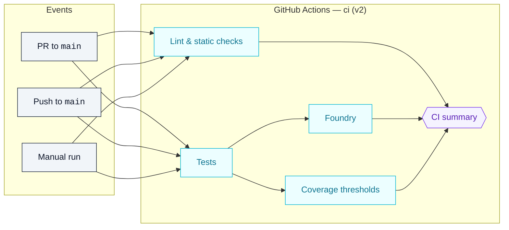

# AGI Jobs v0 — CI v2 Operations Guide

This guide describes the CI v2 pipeline that protects the AGI Jobs v0 codebase. It documents the workflows that run on `main` and every pull request, shows how the jobs depend on each other, and captures the branch protection settings that need to be enforced so the checks are always visible.

For a hands-on validation log that you can hand to compliance or executive stakeholders, see the companion [CI v2 validation report template](ci-v2-validation-report.md). It walks through the exact commands, expected outputs, and artefact exports required to demonstrate a fully green run.



## Workflow triggers

The [`ci.yml`](../.github/workflows/ci.yml) workflow runs when:

- A pull request targets `main`.
- A push lands on `main`.
- A maintainer manually triggers a run with **Run workflow**.

All three entry points converge on the same job graph, keeping the `CI summary` gate visible on every pull request—even when a maintainer forces a manual dry run.

## Required jobs and branch protection

Enable branch protection on `main` with every status context below. The list mirrors [`ci/required-contexts.json`](../ci/required-contexts.json) so automated audits and the GitHub UI stay synchronised.【F:ci/required-contexts.json†L1-L23】 Companion workflows (`fuzz`, `static-analysis`, `webapp`, `containers`, `e2e`) are tracked in [`ci/required-companion-contexts.json`](../ci/required-companion-contexts.json) and enforced alongside the primary CI jobs.【F:ci/required-companion-contexts.json†L1-L7】

> 🔄 **Self-checking contexts:** The lint job now runs `npm run ci:sync-contexts -- --check`, `npm run ci:verify-contexts`, and `npm run ci:verify-companion-contexts`, parsing `.github/workflows/ci.yml` plus the companion manifest to fail the pipeline when required check lists drift. This keeps non-technical approvers from encountering missing checks in the UI.【F:.github/workflows/ci.yml†L53-L64】【F:scripts/ci/update-ci-required-contexts.ts†L1-L98】【F:scripts/ci/check-ci-required-contexts.ts†L1-L72】【F:scripts/ci/check-ci-companion-contexts.ts†L1-L74】

### Core execution gate

| Check context                    | Source job       | Notes                                                                  |
| -------------------------------- | ---------------- | ---------------------------------------------------------------------- |
| `ci (v2) / Lint & static checks` | `lint` job       | Blocks merges when linting or formatting drifts.                       |
| `ci (v2) / Tests`                | `tests` job      | Compiles contracts, regenerates constants, and runs the Hardhat suite. |
| `ci (v2) / Foundry`              | `foundry` job    | Executes Foundry fuzzing even when upstream tests fail.                |
| `ci (v2) / Coverage thresholds`  | `coverage` job   | Enforces ≥90 % coverage and access-control reporting.                  |
| `ci (v2) / Invariant tests`      | `invariants` job | Runs the dedicated forge invariant harness with 512 fuzz runs.         |

### Python intelligence lattice

| Check context                           | Source job               | Notes                                                                          |
| --------------------------------------- | ------------------------ | ------------------------------------------------------------------------------ |
| `ci (v2) / Python unit tests`           | `python_unit` job        | Covers paymaster, tools, orchestrator, and simulation tests under coverage.    |
| `ci (v2) / Python integration tests`    | `python_integration` job | Exercises API routes and demo orchestrations with shared coverage.             |
| `ci (v2) / Load-simulation reports`     | `python_load_sim` job    | Generates Monte Carlo load sweeps and raises on unexpected dissipation optima. |
| `ci (v2) / Python coverage enforcement` | `python_coverage` job    | Combines unit/integration coverage and exports XML artefacts.                  |

### Governance & readiness demonstrations

| Check context                                    | Source job                         | Notes                                                                                                                                                                                               |
| ------------------------------------------------ | ---------------------------------- | --------------------------------------------------------------------------------------------------------------------------------------------------------------------------------------------------- |
| `ci (v2) / HGM guardrails`                       | `hgm_guardrails` job               | Runs the Higher Governance Machine regression suite across Node + Python toolchains.                                                                                                                |
| `ci (v2) / Owner control assurance`              | `owner_controls` job               | Executes the owner control doctor and parameter matrix against the `ci` configuration set, failing fast if any subsystem config is missing or malformed so pause/governance levers remain operable. |
| `ci (v2) / Phase 6 readiness`                    | `phase6` job                       | Validates the Phase 6 manifest and UI bundle.                                                                                                                                                       |
| `ci (v2) / Phase 8 readiness`                    | `phase8` job                       | Confirms the Phase 8 expansion kit builds cleanly.                                                                                                                                                  |
| `ci (v2) / Kardashev II readiness`               | `kardashev_demo` job               | Replays the Kardashev II demo manifests.                                                                                                                                                            |
| `ci (v2) / ASI Take-Off Demonstration`           | `asi_takeoff_demo` job             | Executes the ASI take-off deterministic kit and uploads artefacts.                                                                                                                                  |
| `ci (v2) / Zenith Sapience Demonstration`        | `zenith_demo` job                  | Runs deterministic + local Zenith Sapience rehearsals.                                                                                                                                              |
| `ci (v2) / Celestial Archon Demonstration`       | `celestial_archon_demo` job        | Exercises the Celestial Archon runbook and local rehearsal.                                                                                                                                         |
| `ci (v2) / Hypernova Governance Demonstration`   | `hypernova_demo` job               | Rebuilds and rehearses the Hypernova suite.                                                                                                                                                         |
| `ci (v2) / AGI Labor Market Grand Demo`          | `agi_labor_market_demo` job        | Produces the labour market transcript export.                                                                                                                                                       |
| `ci (v2) / Sovereign Mesh Demo — build`          | `sovereign_mesh_demo` job          | Builds the Sovereign Mesh server + React console.                                                                                                                                                   |
| `ci (v2) / Sovereign Constellation Demo — build` | `sovereign_constellation_demo` job | Builds the Sovereign Constellation server + console.                                                                                                                                                |

### Policy enforcement & summary

| Check context                       | Source job              | Notes                                                                             |
| ----------------------------------- | ----------------------- | --------------------------------------------------------------------------------- |
| `ci (v2) / Branch protection guard` | `branch_protection` job | Audits GitHub branch protection via the API and fails if required contexts drift. |
| `ci (v2) / CI summary`              | `summary` job           | Aggregates upstream job outcomes, fails when any dependency is non-success, and now enforces the presence of the status artefact bundle.    |

> ✅ **Tip:** In GitHub branch protection, mark `Require branches to be up to date` and **Include administrators** so every push re-runs the workflow and administrators respect the gate.

### Quick verification from the command line

After applying or updating branch protection rules, verify them without leaving the terminal:

```bash
npm run ci:sync-contexts -- --check
npm run ci:verify-contexts
npm run ci:verify-companion-contexts
npm run ci:verify-branch-protection
npm run ci:enforce-branch-protection -- --dry-run
npm run ci:preflight
```

Run `npm run ci:verify-contexts` after editing job display names to confirm the workflow and branch rule stay aligned before pushing a branch. It emits a concise ✅/❌ summary and surfaces duplicates or missing entries immediately.【F:scripts/ci/check-ci-required-contexts.ts†L1-L72】

> 🧠 **Deterministic toolchain check:** `npm run ci:preflight` validates `.nvmrc`, `package.json` engine pins, the `packageManager` declaration, and every `package-lock.json` before any dependencies install. It mirrors the GitHub Actions guard so local edits surface problems instantly.【F:package.json†L3-L7】【F:scripts/ci/check-toolchain-locks.js†L1-L120】【F:scripts/ci/check-lock-integrity.js†L1-L78】

> 🛡️ **Lockfile integrity enforcement:** All workflows call [`./scripts/ci/npm-ci.sh`](../scripts/ci/npm-ci.sh) instead of raw `npm ci`. The wrapper validates the resolved lockfile with `jq`, purges stale `node_modules`, and then runs `npm ci --no-audit --prefer-offline --progress=false`, ensuring a corrupted or missing lock fails fast across every workspace (including UI subprojects that set `NPM_CI_PROJECT_ROOT`).【F:scripts/ci/npm-ci.sh†L1-L28】【F:.github/workflows/webapp.yml†L33-L43】

Use `npm run ci:enforce-branch-protection` with a maintainer token to push the manifested contexts to GitHub automatically. Pass `--dry-run` first to review the diff, then rerun without the flag to update the rule with strict status checks and administrator enforcement preserved.【F:scripts/ci/enforce-branch-protection.ts†L1-L279】

Set `GITHUB_TOKEN` (or `GH_TOKEN`) with `repo` scope first. The script auto-detects the repository from `GITHUB_REPOSITORY` or the local git remote and prints a status table covering contexts, ordering, the `strict` flag, and the **Include administrators** toggle. Provide `--owner`, `--repo`, or `--branch` when auditing forks.

Prefer the GitHub CLI? These equivalent commands still work:

```bash
gh api repos/:owner/:repo/branches/main/protection --jq '{required_status_checks: .required_status_checks.contexts}'
gh api repos/:owner/:repo/branches/main/protection --jq '.enforce_admins.enabled'
```

The first command should list the required contexts above in order. The second confirms admins are also blocked when the pipeline is red.

### Companion workflow checks

Keep the rest of the release surface visible by marking the following workflows as required checks as well:

| Workflow                           | Job context              | Purpose                                                         |
| ---------------------------------- | ------------------------ | --------------------------------------------------------------- |
| `.github/workflows/e2e.yml`        | `e2e / orchestrator-e2e` | Executes forked-mainnet drills and dispute flows end to end.    |
| `.github/workflows/fuzz.yml`       | `fuzz / forge-fuzz`      | Runs the nightly-grade Foundry fuzz suite on every PR.          |
| `.github/workflows/webapp.yml`     | `webapp / webapp-ci`     | Lints, type-checks, builds, and smoke-tests both web frontends. |
| `.github/workflows/containers.yml` | `containers / build (node-runner)`<br>`containers / build (validator-runner)`<br>`containers / build (gateway)`<br>`containers / build (webapp)`<br>`containers / build (owner-console)` | Asserts Docker images build and pass enforced Trivy scans for every published image.      |

> 📌 **Path-filtered option:** When you want Docker provenance for UI updates, also require `apps-images / console` and `apps-images / portal`. These jobs only trigger when files under `apps/**` change, so skip them if your project relies on wide fan-out PRs that seldom touch the UIs.

## Pull request hygiene checklist

1. Confirm that the **Checks** tab shows every required `ci (v2)` context above plus the companion workflows you have marked as required.
2. Inspect the **Artifacts** section for `coverage-lcov` when coverage needs auditing.
3. Review the `CI summary` job output for a condensed Markdown table of job results. The job now also archives the same table as
   `reports/ci/status.md` together with a machine-readable `status.json`, both available in the `ci-summary` artifact for
   compliance records. The upload step is hardened with `if-no-files-found: error`, so missing artefacts flip the entire workflow red instead of silently succeeding.【F:.github/workflows/ci.yml†L1130-L1259】 The table labels branch-protection skips on forks as `SKIPPED (permitted)` so reviewers know the guardrail remains enforced on `main`.
4. When re-running failed jobs, choose **Re-run failed jobs** to keep historical logs.
5. If a dependent job unexpectedly skips, inspect the workflow definition to confirm the `if: ${{ always() }}` guard is still present.

## Local dry run for contributors

Developers can approximate the pipeline locally with:

```bash
npm ci
npm run format:check
npm run lint:ci
npm test
npm run coverage
forge test -vvvv --ffi --fuzz-runs 256
```

Running the commands in this order matches the GitHub workflow dependencies, letting contributors catch failures before opening a pull request.

### Environment guardrails enforced by CI

The workflow pins several environment variables so simulation runs stay aligned with production expectations. Operators can adjust the source JSON config files and rely on CI to confirm the invariants below.

| Variable                                                                     | Purpose                                                        | Where enforced                                     |
| ---------------------------------------------------------------------------- | -------------------------------------------------------------- | -------------------------------------------------- |
| `COVERAGE_MIN`                                                               | Minimum overall coverage percentage (currently `90`).          | `coverage` job → `node scripts/check-coverage.js`. |
| `ACCESS_CONTROL_PATHS`                                                       | Directories that must meet access-control coverage thresholds. | `coverage` job → `npm run check:access-control`.   |
| `FEE_PCT`, `BURN_PCT`, `TREASURY`                                            | Default fee routing constants consumed by Hardhat tests.       | `tests` job → `scripts/generate-constants.ts`.     |
| `VALIDATORS_PER_JOB`, `REQUIRED_APPROVALS`, `COMMIT_WINDOW`, `REVEAL_WINDOW` | Validator defaults surfaced in Hardhat + Foundry suites.       | `tests` & `foundry` jobs.                          |

Any change to those values inside `config/` or environment overrides forces the workflow to regenerate constants, rerun tests, and verify access-control coverage so non-technical maintainers get immediate feedback.

## Operational playbook

- **Incident response:** When a CI job fails on `main`, triage by inspecting the job logs, then open an incident ticket using the `owner-control-change-ticket.md` template.
- **Temporarily skipping jobs:** Use GitHub's `workflow_dispatch` trigger to run a targeted branch with fixes instead of editing the workflow file.
- **Infrastructure updates:** Record any changes to cache keys or environment variables in `docs/release-checklist.md` and attach a PR link for traceability.
- **Hypernova drill:** If the `hypernova_demo` job regresses, rerun `npm run demo:zenith-hypernova` locally to reproduce, capture the reports in `reports/zenith-hypernova/`, and attach them to the incident ticket for non-technical owners.

## Audit checkpoints

- CI secrets should be scoped to read-only access; verify them quarterly and record the review in `docs/owner-control-audit.md`.
- Review branch protection rules weekly to ensure required checks still match the workflow job names.
- Capture coverage threshold decisions in `docs/green-path-checklist.md` so downstream owners understand the rationale for the configured `COVERAGE_MIN`.

Maintaining these guardrails keeps AGI Jobs v0 deployable by non-technical stakeholders while satisfying the "fully green" CI expectation.
