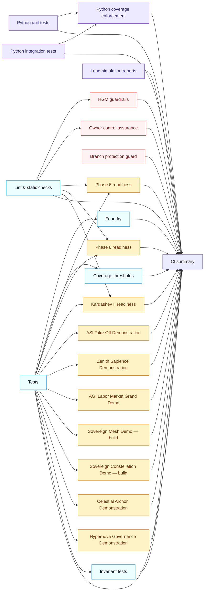

# CI v2 Operations Playbook

The `ci (v2)` workflow is the canonical gating pipeline for AGI Jobs v0 (v2). It fans out
across linting, contract verification, demo rehearsals, and governance audits while
feeding a single summary signal back to branch protection.

## Workflow topology



The workflow enforces concurrency, hardened runners, and aggressive caching to keep
turnaround tight even with a large job fan-out.

## Local rehearsal

1. Install Node.js 20.19.0 and enable npm caching via `actions/setup-node`, matching the
   pipeline toolchain.
2. Run the same lint entry point the workflow executes:
   ```bash
   npm ci --no-audit --prefer-offline --progress=false
   npm run ci:verify-toolchain
   npm run ci:sync-contexts -- --check
   npm run ci:verify-contexts
   npm run ci:verify-companion-contexts
   npm run lint:ci
   ```
   These commands mirror the `lint` job steps so pull requests fail locally before they
   hit the queue.
3. Execute contract and Foundry suites:
   ```bash
   npx ts-node --compiler-options '{"module":"commonjs"}' scripts/generate-constants.ts
   npm test
   forge test -vvvv --ffi --fuzz-runs 256
   ```
   This reproduces the `tests`, `foundry`, and `invariants` jobs end-to-end.
4. Run the Python analytics surface with coverage:
   ```bash
   pip install -r requirements-python.txt
   coverage run --rcfile=.coveragerc -m pytest test/paymaster test/tools test/orchestrator test/simulation
   coverage run --rcfile=.coveragerc --append -m pytest tests packages/hgm-core/tests demo/Huxley-Godel-Machine-v0/tests
   coverage xml --rcfile=.coveragerc -o reports/python-coverage/unit.xml
   ```
   Combine coverage using `coverage combine` and enforce thresholds exactly as the
   workflow does.
5. For governance demos, run the deterministic rehearsal scripts via npm targets such as
   `npm run demo:zenith-sapience-initiative:local` before pushing. The CI jobs wire in
   the same environment variables and RPC endpoints shown in the workflow file.

## Status context manifest

Branch protection derives its required contexts from JSON manifests committed in the
repository. Update them through typed scripts instead of editing by hand:

- `ci/required-contexts.json` enumerates every `ci (v2)` job enforced on the main rule.
- `ci/required-companion-contexts.json` lists workflows such as fuzzing and static analysis
  that branch protection must also surface.
- `npm run ci:sync-contexts` regenerates both manifests from the workflow definition and
  fails when checked-in data drifts.
- `npm run ci:verify-contexts` and `npm run ci:verify-companion-contexts` assert the stored
  manifests match the actual workflow graph.

## Branch protection and enforcement

The `branch_protection` job runs on trusted branches and validates that GitHub’s rule-set
matches the manifests above, requiring strict checks and admin enforcement.
Administrators can patch misconfigured rules locally with:

```bash
npm run ci:enforce-branch-protection -- --branch main --token <ghp_...>
```

The script updates or creates the protection rule through GitHub’s GraphQL API while
respecting the context manifests.

## Artefacts and reporting

Every job uploads deterministic artefacts (coverage, owner-control matrices, demo
transcripts). The `summary` job fans in from all required jobs, publishes a Markdown
status table to the run summary, and stores `reports/ci/status.{md,json}`. Missing
artefacts fail the run so audit trails remain intact.

Always download the summary bundle when preparing release notes—the JSON payload is ready
for ingestion into downstream governance dashboards.
