# AGI Jobs v0 — CI v2 Operations Guide

This guide describes the CI v2 pipeline that protects the AGI Jobs v0 codebase. It documents the workflows that run on `main` and every pull request, shows how the jobs depend on each other, and captures the branch protection settings that need to be enforced so the checks are always visible.

```mermaid
flowchart LR
    classDef trigger fill:#f1f5f9,stroke:#1e293b,stroke-width:1px,color:#0f172a;
    classDef job fill:#ecfeff,stroke:#06b6d4,stroke-width:1px,color:#0e7490;
    classDef gate fill:#f5f3ff,stroke:#7c3aed,stroke-width:1px,color:#5b21b6;

    subgraph Events
        PR[PR to <code>main</code>]:::trigger
        Main[Push to <code>main</code>]:::trigger
        Manual[Manual run]:::trigger
    end

    subgraph "GitHub Actions — ci (v2)"
        direction LR
        Lint[Lint & static checks]:::job --> Summary{{CI summary}}:::gate
        Tests[Tests]:::job --> Foundry[Foundry]:::job --> Summary
        Tests --> Coverage[Coverage thresholds]:::job --> Summary
        Tests --> Invariants[Invariant tests]:::job --> Summary
        Tests --> DryRun[Testnet dry-run rehearsal]:::job --> Summary
    end

    PR & Main & Manual --> Lint
    PR & Main & Manual --> Tests
```



## Workflow triggers

The [`ci.yml`](../.github/workflows/ci.yml) workflow runs when:

- A pull request targets `main`.
- A push lands on `main`.
- A maintainer manually triggers a run with **Run workflow**.

All three entry points converge on the same job graph, keeping the `CI summary` gate visible on every pull request—even when a maintainer forces a manual dry run.

## Required jobs and branch protection

Enable branch protection on `main` with these required status checks (copy the contexts exactly as they appear in the GitHub UI):

| Check context | Source job | Notes |
| --- | --- | --- |
| `ci (v2) / Lint & static checks` | `lint` job | Blocks merge when linting fails. |
| `ci (v2) / Tests` | `tests` job | Runs Hardhat compilation and the main test suite. |
| `ci (v2) / Foundry` | `foundry` job | Always runs after the `tests` job, even when it fails, to expose fuzz failures. |
| `ci (v2) / Coverage thresholds` | `coverage` job | Enforces `COVERAGE_MIN` and access-control coverage. |
| `ci (v2) / Invariant tests` | `invariants` job | Executes long-horizon Foundry invariants for governance-critical properties. |
| `ci (v2) / Testnet dry-run rehearsal` | `dry-run` job | Exercises the owner rehearsal harness and publishes JSON evidence. |
| `ci (v2) / CI summary` | `summary` job | Fails when any dependency job fails so the PR badge stays red. |

> ✅ **Tip:** In GitHub branch protection, mark `Require branches to be up to date` to guarantee pull requests re-run the workflow when `main` advances.

### Quick verification from the command line

After applying or updating branch protection rules, verify them without leaving the terminal:

```bash
npm run ci:verify-branch-protection
```

Set `GITHUB_TOKEN` (or `GH_TOKEN`) with `repo` scope first. The script auto-detects the repository from `GITHUB_REPOSITORY` or the local git remote and prints a status table covering contexts, ordering, the `strict` flag, and the **Include administrators** toggle. Provide `--owner`, `--repo`, or `--branch` when auditing forks.

Prefer the GitHub CLI? These equivalent commands still work:

```bash
gh api repos/:owner/:repo/branches/main/protection --jq '{required_status_checks: .required_status_checks.contexts}'
gh api repos/:owner/:repo/branches/main/protection --jq '.enforce_admins.enabled'
```

The first command should list the seven required contexts above in order. The second confirms admins are also blocked when the pipeline is red.

### Companion workflow checks

Keep the rest of the release surface visible by marking the following workflows as required checks as well:

| Workflow | Job context | Purpose |
| --- | --- | --- |
| `.github/workflows/e2e.yml` | `e2e / orchestrator-e2e` | Executes forked-mainnet drills and dispute flows end to end. |
| `.github/workflows/fuzz.yml` | `fuzz / forge-fuzz` | Runs the nightly-grade Foundry fuzz suite on every PR. |
| `.github/workflows/webapp.yml` | `webapp / webapp-ci` | Lints, type-checks, builds, and smoke-tests both web frontends. |
| `.github/workflows/containers.yml` | `containers / build` | Asserts Docker images build and pass enforced Trivy scans. |

> 📌 **Path-filtered option:** When you want Docker provenance for UI updates, also require `apps-images / console` and `apps-images / portal`. These jobs only trigger when files under `apps/**` change, so skip them if your project relies on wide fan-out PRs that seldom touch the UIs.

## Pull request hygiene checklist

1. Confirm that the **Checks** tab shows all seven required `ci (v2)` contexts above plus the companion workflows you have marked as required.
2. Inspect the **Artifacts** section for `coverage-lcov` when coverage needs auditing.
3. Review the `CI summary` job output for a condensed Markdown table of job results.
4. When re-running failed jobs, choose **Re-run failed jobs** to keep historical logs.
5. If a dependent job unexpectedly skips, inspect the workflow definition to confirm the `if: ${{ always() }}` guard is still present.

## Local dry run for contributors

Developers can approximate the pipeline locally with:

```bash
npm ci
npm run format:check
npm run lint:ci
npm test
npm run coverage
forge test -vvvv --ffi --fuzz-runs 256
```

Running the commands in this order matches the GitHub workflow dependencies, letting contributors catch failures before opening a pull request.

### Environment guardrails enforced by CI

The workflow pins several environment variables so simulation runs stay aligned with production expectations. Operators can adjust the source JSON config files and rely on CI to confirm the invariants below.

| Variable | Purpose | Where enforced |
| --- | --- | --- |
| `COVERAGE_MIN` | Minimum overall coverage percentage (currently `90`). | `coverage` job → `node scripts/check-coverage.js`. |
| `ACCESS_CONTROL_PATHS` | Directories that must meet access-control coverage thresholds. | `coverage` job → `npm run check:access-control`. |
| `FEE_PCT`, `BURN_PCT`, `TREASURY` | Default fee routing constants consumed by Hardhat tests. | `tests` job → `scripts/generate-constants.ts`. |
| `VALIDATORS_PER_JOB`, `REQUIRED_APPROVALS`, `COMMIT_WINDOW`, `REVEAL_WINDOW` | Validator defaults surfaced in Hardhat + Foundry suites. | `tests` & `foundry` jobs. |

Any change to those values inside `config/` or environment overrides forces the workflow to regenerate constants, rerun tests, and verify access-control coverage so non-technical maintainers get immediate feedback.

## Operational playbook

- **Incident response:** When a CI job fails on `main`, triage by inspecting the job logs, then open an incident ticket using the `owner-control-change-ticket.md` template.
- **Temporarily skipping jobs:** Use GitHub's `workflow_dispatch` trigger to run a targeted branch with fixes instead of editing the workflow file.
- **Infrastructure updates:** Record any changes to cache keys or environment variables in `docs/release-checklist.md` and attach a PR link for traceability.

## Audit checkpoints

- CI secrets should be scoped to read-only access; verify them quarterly and record the review in `docs/owner-control-audit.md`.
- Review branch protection rules weekly to ensure required checks still match the workflow job names.
- Capture coverage threshold decisions in `docs/green-path-checklist.md` so downstream owners understand the rationale for the configured `COVERAGE_MIN`.

Maintaining these guardrails keeps AGI Jobs v0 deployable by non-technical stakeholders while satisfying the "fully green" CI expectation.
