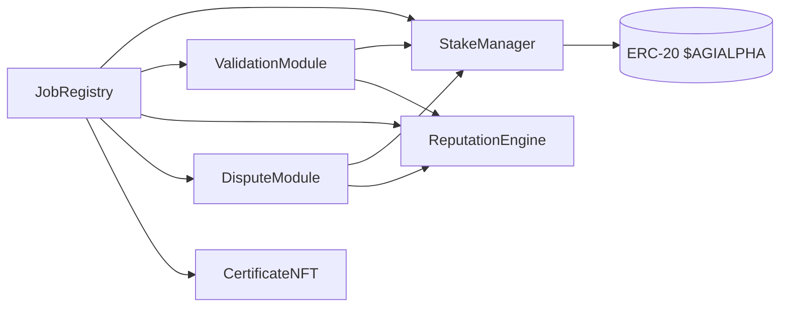

# AGIJobs v2 Module & Interface Reference

This document condenses the production-scale architecture into standalone modules, each with a minimal interface and owner/governance hooks. It is a companion to `docs/architecture-v2.md` and `docs/deployment-v2-agialpha.md` and focuses on contract boundaries plus Solidity structure tips. All modules expose `version()` returning **2** so other components can verify compatibility during upgrades. The reputation system is implemented by a single contract, `contracts/v2/ReputationEngine.sol`, which replaces the former module variant.

> **Authoritative source:** Interfaces live under [`contracts/v2/interfaces/`](../contracts/v2/interfaces) and are consumed by both
> the Hardhat + Foundry test suites and `npm run abi:diff`. If a selector changes,
> regenerate docs by running `npm run owner:parameters -- --format markdown` and
> update the tables below instead of copying snippets by hand.

## Module Graph

## Core Interfaces (Solidity ^0.8.20)

| Contract | Key methods (see interface for full detail) | Control guard |
| --- | --- | --- |
| `IJobRegistry` | Job lifecycle (`createJob`, `submitResult`, `finalize`), module wiring (`setModules`, `setIdentityRegistry`), allowlists (`addAdditionalAgent`, `removeAdditionalAgent`), acknowledger ACLs, fee/treasury tuning. | `onlyGovernance` / `onlyGovernanceOrPauser`【F:contracts/v2/JobRegistry.sol†L1096-L1273】 |
| `IStakeManager` | Stake deposits, reward locking, slashing, treasury routing, module wiring (`setModules`, `setValidationModule`). | `onlyGovernance`【F:contracts/v2/StakeManager.sol†L720-L1439】 |
| `IValidationModule` | Commit/reveal flow, validator selection, quorum windows, randomness + pool management. | `onlyOwner` (governance-owned)【F:contracts/v2/ValidationModule.sol†L254-L807】 |
| `IReputationEngine` & `IReputationEngineV2` | Reputation adjustments, premium thresholds, blacklist management, μ parameter feeds. | `onlyGovernance`【F:contracts/v2/RewardEngineMB.sol†L112-L227】 |
| `IDisputeModule` | Dispute intake/resolution, moderator + committee management, module wiring. | `onlyGovernance`【F:contracts/v2/modules/DisputeModule.sol†L73-L219】 |
| `ICertificateNFT` | Issue credentials, tune base URI, manage minters, pause/unpause gating. | `onlyOwner`【F:contracts/v2/CertificateNFT.sol†L41-L115】 |
| `IEnergyOracle` | Verify energy attestations, signer management. | `onlyGovernance`【F:contracts/v2/EnergyOracle.sol†L21-L57】 |
| `IThermostat` | PID tuning, role temperatures, safety bounds. | `onlyGovernance`【F:contracts/v2/Thermostat.sol†L52-L107】 |
| `IHamiltonian` (`HamiltonianMonitor`) | Observation window, history reset, observation ingestion. | `onlyGovernance`【F:contracts/v2/HamiltonianMonitor.sol†L38-L144】 |

## Solidity Structure Recommendations

- Mark module addresses `immutable` and cache them in local variables.
- Pack small variables (`uint64`, `uint96`) to minimise storage slots.
- Prefer `external` + `calldata` for user calls; use custom errors over revert strings.
- Apply `unchecked` arithmetic where bounds are enforced to save gas.
- Guard token transfers with `nonReentrant` in `StakeManager` and `JobRegistry`.
- Emit events for every configuration change so off-chain services can track state.

## Incentive & Physics Analogy

Stakes form potential energy \(H\); commit–reveal voting injects entropy \(S\). Owner‑tuned parameters act as temperature \(T\). The network evolves toward minimum Gibbs free energy \(G = H - TS\), making honest behaviour the dominant, low‑energy strategy. Slashing raises \(H\) for cheaters, while random validator selection increases \(S\), keeping collusion energetically unfavourable.

## Owner Control & Token Flexibility

All setters are `onlyOwner`. v2 assumes the 18‑decimal [$AGIALPHA](https://etherscan.io/address/0xA61a3B3a130a9c20768EEBF97E21515A6046a1fA) token for all modules with the address fixed at deployment. All amounts are supplied in base units (1 token = 1e18). For example `0.1` token is `100_000000000000000` and `12` tokens are `12_000000000000000000`.

## Governance Composability

- Modules are immutable once deployed; to upgrade a component the owner deploys a new module and calls `JobRegistry.setModules` with the replacement address.
- Parameter tweaks emit dedicated events (`ParameterUpdated`, `ModuleUpdated`) so off-chain tooling and multisigs can monitor governance moves.
- Minimal, single-purpose setters keep Etherscan interactions straightforward for non-technical owners while ensuring clear on-chain audit trails.
- The [owner-control-authority-reference](owner-control-authority-reference.md) links each governance lever to CLI helpers so non-technical operators can execute Safe bundles without reading Solidity.
