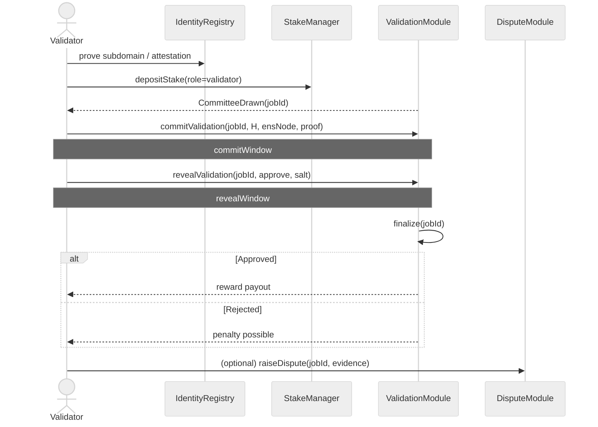
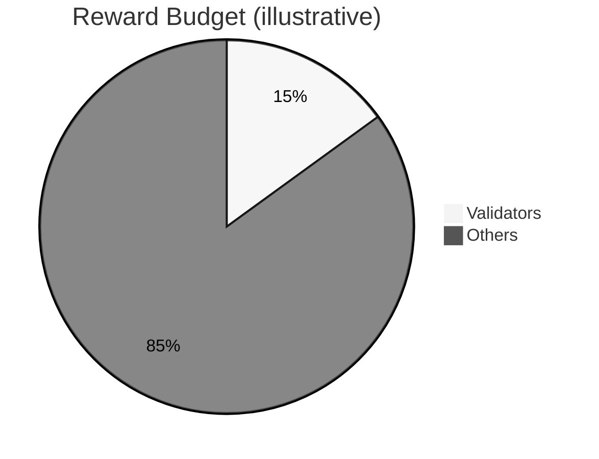
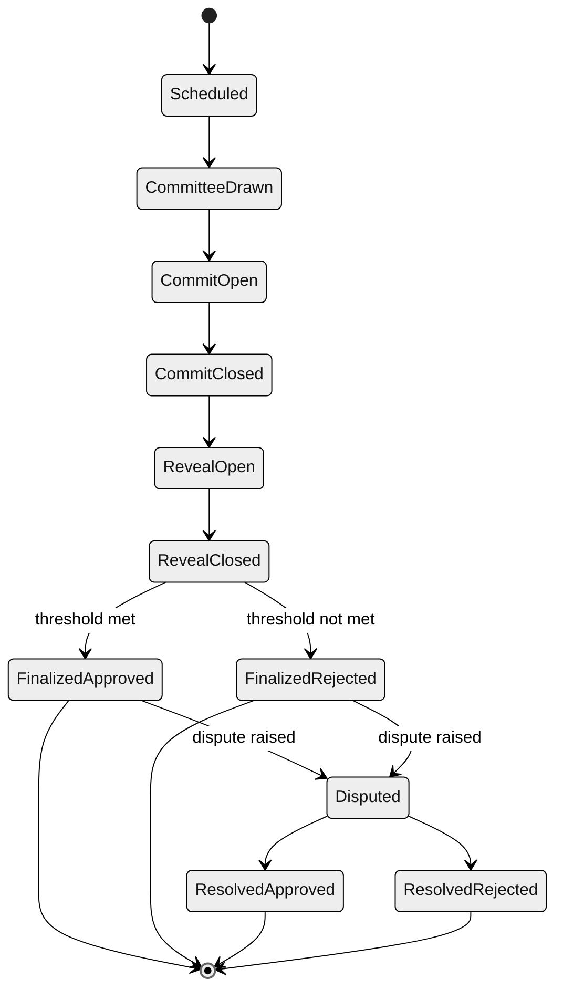
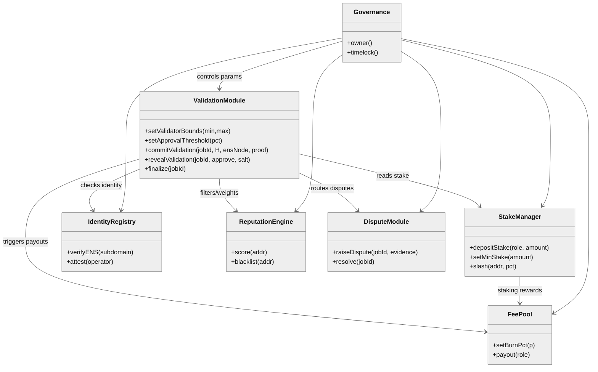

# AGIJobsv0 — **Validator Handbook**

> This version adds compact, elegant **Mermaid** diagrams for fast comprehension. Diagrams render on GitHub, GitLab, and most modern doc sites.

---

## Table of Contents
- [TL;DR](#tldr)
- [1) Role & Eligibility](#1-role--eligibility)
- [2) 5‑Minute Onboarding](#2-5minute-onboarding)
- [3) Big Picture (Flow)](#3-big-picture-flow)
- [4) Committee Selection (How You’re Chosen)](#4-committee-selection-how-youre-chosen)
- [5) Voting: Commit → Reveal → Finalize](#5-voting-commit--reveal--finalize)
- [6) Rewards, Fees & Slashing](#6-rewards-fees--slashing)
- [7) Parameters You Should Know](#7-parameters-you-should-know)
- [8) Operational Hygiene](#8-operational-hygiene)
- [9) Reference Diagrams](#9-reference-diagrams)
- [10) Quick Reference](#10-quick-reference)
- [11) Support](#11-support)

---

## TL;DR
- **Who?** Validators are independent reviewers who decide if an agent’s job submission is valid.  
- **What you need:** An ENS subname under `*.club.agi.eth` (or `*.alpha.club.agi.eth`), an authorized wallet, and active stake.  
- **How it works:** You may be **randomly selected** into a committee → **commit** your vote → **reveal** it → job **finalizes** → **rewards/slashing** settle.  
- **Payouts:** Validators receive a governance‑tuned share of the reward budget (initial policy: **15%**).  
- **Risks:** No‑shows or dishonest voting can be **slashed** and reduce future selection chances.

---

## 1) Role & Eligibility
- **Role:** Evaluate a job’s result (approve/reject) according to the job spec and evidence provided.  
- **Identity:** Own `<you>.club.agi.eth` (or `<you>.alpha.club.agi.eth`). If you operate from a hot wallet, **attest** that wallet as your validator key.  
- **Stake:** Deposit stake for **role = validator** to become *active*.  
- **Standing:** Maintain good standing (no unresolved slashes/disputes); inactivity or poor accuracy lowers your reputation weight.

> **Tip:** Keep ENS owner keys cold; use an **attested** hot key for daily validator actions.

---

## 2) 5‑Minute Onboarding
1. **Acquire identity:** Register `<you>.club.agi.eth` (or the `alpha.` variant).  
2. **Authorize your hot wallet (optional):** Create an **attestation** linking it to your ENS name for validator actions.  
3. **Stake:** Approve token, then call `depositStake(role=validator, amount)`; confirm **Active** status.  
4. **Run tools:** Use the CLI/UI to watch for selection events and deadline windows.  
5. **Practice flow:** Join a test job, perform **commit → reveal**, and verify your payout path.

---

## 3) Big Picture (Flow)

```mermaid
%%{init: {'theme':'neutral'}}%%
flowchart LR
    A([Start]) --> B[Identity<br/>(ENS subname under *.club.agi.eth)]
    B --> C[Stake deposit<br/>role=validator]
    C --> D{Eligible?<br/>Active + minStake + reputation OK}
    D -- No --> C
    D -- Yes --> E[Committee selection<br/>(VRF + weighted sortition)]
    E --> F[Commit vote<br/>(hash)]
    F --> G[Reveal vote]
    G --> H{Threshold met?}
    H -- Yes --> I[Finalize:<br/>Approve/Reject]
    H -- No --> J[Resample or Dispute]
    I --> K[[Rewards]]
    J --> L[[Penalties / Slashing]]
```

---

## 4) Committee Selection (How You’re Chosen)

- **When:** On job scheduling, the protocol draws a **committee** of size **K** within configured bounds (e.g., 5–9).  
- **Randomness:** A **verifiable randomness** beacon (e.g., VRF) seeds the draw to prevent bias.  
- **Eligibility:** Active validators that (a) pass identity checks, (b) meet **minStake**, (c) aren’t rate‑limited/blacklisted.  
- **Weighting:** Sortition is **stake × reputation** weighted, with anti‑concentration (avoid over‑selecting the same entity).  
- **Liveness:** If selected validators don’t commit in time, the module **resamples** until quorum ≥ `minValidators`.

```mermaid
%%{init: {'theme':'neutral'}}%%
flowchart TB
    subgraph Eligibility_Set[Eligibility Set]
      X1[Identity verified] --> X2[Active stake ≥ min]
      X2 --> X3[Good standing (reputation)]
    end
    subgraph Selection[Selection]
      S1[VRF seed] --> S2[Deterministic scoring]
      S2 --> S3[Stake × Reputation weighting]
      S3 --> S4[Pick top‑K without replacement]
      S4 --> S5[Anti‑concentration check]
    end
    Eligibility_Set --> Selection --> S6([Committee])
```

> **What to do:** Keep your node online; when selected, you’ll see `CommitteeDrawn(jobId, members[])`. Missing the **commit** window risks penalties.

---

## 5) Voting: Commit → Reveal → Finalize

**Commit (private vote)**  
Compute `H = keccak256(jobId, approveBit, ensNode, msg.sender, salt)` and call  
`commitValidation(jobId, H, ensNode, proof)` within the **commit window**.

**Reveal (public vote)**  
Call `revealValidation(jobId, approveBit, salt)` within the **reveal window**.

**Finalize**  
Anyone can call `finalize(jobId)` after reveal closes. The job passes if:
- Reveals ≥ `minValidators` **and** approvals meet `approvalThreshold` (default 66%, so two approvals finalise a three-validator round).
- Results route rewards/penalties; reputation updates are emitted.



**Deadline discipline:** Missing commit or reveal counts as **no‑show** and may be penalized.

---

## 6) Rewards, Fees & Slashing

- **Rewards:** Validators share a governance‑tuned slice of the reward engine (**initial policy: 15%**). Per‑job payout may weight:  
  - Accuracy vs. dispute outcomes  
  - Timeliness (on‑time commit & reveal)  
  - Agreement quality (dispute‑corrected, not mere herding)



- **Fees/Burns:** A small burn may apply; the remainder is distributed to stakers per policy.  
- **Slashing (examples):**
  - **No‑show:** Selected but failed to commit/reveal → light slash and/or epoch reward loss.  
  - **Dishonest vote:** Clear evidence of knowingly bad votes → heavier slash + reputation hit.  
  - **Collusion/bribery:** On proven case → strong slash, blacklist, and reputation reset.

> **Appeals/Disputes:** Anyone may raise a dispute on a finalized job. A dispute ruling can adjust outcomes and trigger slashes.

---

## 7) Parameters You Should Know

- `minStake` — minimum stake to be eligible.  
- `validatorBounds(min,max)` — committee size range per job.  
- `approvalThreshold` — % approvals required to pass.  
- `commitWindow`, `revealWindow` — time windows for your actions.  
- `slashingPercents` — penalty schedule.  
- `burnPct` / treasury routing — fee policy.

> **Typical starting points (tune per chain latency & volume):**  
> `minStake`: ≥ 2–5× max per‑job validator payout • `K`: 5–9 • `approvalThreshold`: ≥66% (two approvals in a three-member committee) • `commitWindow`: 30–60 min • `revealWindow`: 15–30 min.

---

## 8) Operational Hygiene

- **Keys:** Keep ENS owner keys cold; use **attested** hot keys for daily ops.  
- **Uptime:** Run a watcher to alert you on selection and impending deadlines.  
- **Record‑keeping:** Keep local logs of decisions, evidence considered, and hashes/salts until payouts settle.  
- **Conflicts:** If conflicted, **decline selection** early (where supported) rather than risk a slash.  
- **Upgrades:** Watch governance announcements for parameter changes.

---

## 9) Reference Diagrams

### 9.1 Job Validation — State Machine



### 9.2 Modules & Interactions (Class Diagram)



---

## 10) Quick Reference

- **Watch events:** `CommitteeDrawn(jobId, members[])`, `CommitWindow(jobId)`, `RevealWindow(jobId)`, `Finalized(jobId, outcome)`  
- **Actions:**  
  - `commitValidation(jobId, commitment, ensNode, proof)`  
  - `revealValidation(jobId, approve, salt)`  
  - (System) `finalize(jobId)`

**Commit hash formula:**

```text
H = keccak256(jobId, approveBit, ensNode, msg.sender, salt)
```

---

## 11) Support
- **Issues:** Open a GitHub issue with your `jobId`, tx hashes, and timestamps.  
- **Security:** If you discover an exploit or bribery market, use the **responsible disclosure** channel listed in the repository.

---

**Stay accurate, stay timely, and keep your identity & stake secure.**
