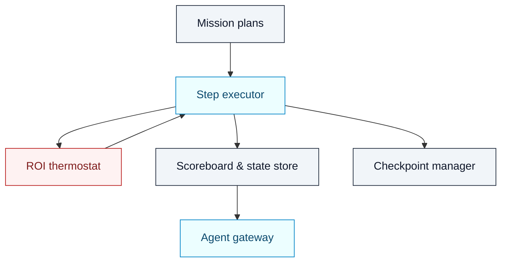

# AGI Jobs v0 (v2) — Orchestrator Engine

[](https://github.com/MontrealAI/AGIJobsv0/actions/workflows/ci.yml)
[](https://github.com/MontrealAI/AGIJobsv0/actions/workflows/ci.yml)

The Python orchestrator drives hierarchical generative missions across agents, validators, and owner guardrails. It manages
checkpoints, run state, ROI-aware thermostats, and audit-safe persistence so the contract owner can trigger large-scale workflows
without touching infrastructure.

## Core responsibilities

- **Mission planning** – Builds and executes orchestration plans (`OrchestrationPlan`) with deterministic step execution and
  automatic resumption on restart.【F:orchestrator/runner.py†L1-L120】
- **Checkpointing** – Serialises in-flight runs to disk/Redis/Postgres so the orchestrator can recover after interruptions without
  losing progress.【F:orchestrator/runner.py†L57-L119】【F:orchestrator/state.py†L1-L130】
- **Config reflection** – Reads fee and burn percentages from `config/` manifests or environment overrides so ROI calculations stay
  aligned with owner-set parameters.【F:orchestrator/config.py†L1-L63】
- **Scoreboard & analytics** – Maintains live run scoreboards and event reconciliation for dashboards and the agent gateway.



## Directory tour

| Path | Purpose |
| ---- | ------- |
| `models.py` | Pydantic models for orchestration plans, run status, scoreboards. |
| `runner.py` | Step executor, watchdog, and checkpoint restore logic.【F:orchestrator/runner.py†L1-L160】 |
| `state.py` | Pluggable persistence backends (filesystem, Redis, Postgres) for run state.【F:orchestrator/state.py†L1-L130】 |
| `workflows/hgm/` | Higher Governance Machine workflow that integrates with `packages/hgm-core`. |
| `extensions/` | Optional step plugins (notifications, analytics exports). |
| `tools/` | Step execution helpers consumed by `runner.py` and tests. |

## Running locally

```bash
python -m venv .venv
source .venv/bin/activate
pip install -r requirements-python.txt
pytest test/orchestrator -q
python -m orchestrator.scripts.demo_run  # optional dry run helper if defined
```

Set `ORCHESTRATOR_STATE_DIR`, `ORCHESTRATOR_REDIS_URL`, or `ORCHESTRATOR_PG_DSN` to switch persistence backends; the orchestrator
auto-selects `FileRunStateStore` when no environment variables are provided.【F:orchestrator/state.py†L1-L130】

## CI integration

- `ci (v2) / Python unit tests` runs `pytest` over `test/orchestrator/**` with coverage enforced by the `python_coverage` job.【F:.github/workflows/ci.yml†L118-L345】
- `ci (v2) / HGM guardrails` executes the higher-governance suite, validating orchestration flows against the AGI Alpha profile
  defaults.【F:.github/workflows/ci.yml†L352-L420】
- `ci (v2) / Load-simulation reports` consumes orchestrator metrics to generate Monte Carlo dissipation sweeps for owners.【F:.github/workflows/ci.yml†L206-L272】

## Extending the orchestrator

1. Model the new mission in `models.py` and encode steps as subclasses where necessary.
2. Implement the orchestration logic under `workflows/` or `extensions/`.
3. Add deterministic tests under `test/orchestrator/` or `packages/hgm-core/tests` so the CI lattice exercises the new workflow.
4. Update owner tooling (for example `scripts/v2/ownerControlPlan.ts`) if the workflow exposes additional levers to the owner.

By coupling deterministic plans, resilient checkpoints, and owner-driven configuration, the orchestrator keeps the superintelligent
machine deployable by non-technical mission owners while remaining observable and auditable in CI.
