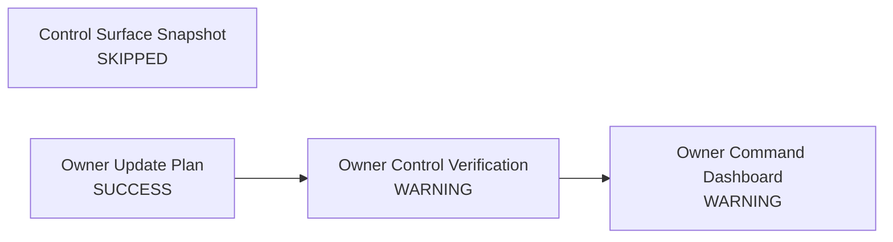

# Owner Mission Control Summary

- **Network:** `hardhat`
- **Generated:** 2025-10-13T18:06:32.781Z
- **Overall status:** ⚠️ `WARNING`

## Control Surface Snapshot

⏭️ **Status:** `SKIPPED` — Step skipped by CLI configuration
- **Duration:** 0ms

## Owner Update Plan

✅ **Status:** `SUCCESS` — No actions required across 0 modules
- **Command:** `/root/.nvm/versions/node/v20.19.4/bin/node scripts/v2/run-owner-plan.js --json`
- **Environment overrides:** `HARDHAT_NETWORK=hardhat`
- **Duration:** 5.18s
- **Metrics:**
    - modules: 0
    - actions: 0
    - pendingModules: 0
- **Details:**
    - No pending actions in the aggregated plan

Logs & Warnings

- [dotenv@17.2.2] injecting env (2) from .env -- tip: ⚙️  override existing env vars with { override: true }
- [dotenv@17.2.2] injecting env (0) from .env -- tip: ⚙️  suppress all logs with { quiet: true }
- npm warn Unknown env config "http-proxy". This will stop working in the next major version of npm.
- Thermodynamics config not found or invalid: RewardEngine address cannot be the zero address
- JobRegistry address resolves to the zero address; skipping.
- StakeManager address resolves to the zero address; skipping.
- FeePool address resolves to the zero address; skipping.
- PlatformRegistry address resolves to the zero address; skipping.
- PlatformIncentives address resolves to the zero address; skipping.
- TaxPolicy address resolves to the zero address; skipping.
- RandaoCoordinator address resolves to the zero address; skipping.
- IdentityRegistry address resolves to the zero address; skipping.
- No module addresses resolved; nothing to plan.
- npm warn Unknown env config "http-proxy". This will stop working in the next major version of npm.
- Thermodynamics config not found or invalid: RewardEngine address cannot be the zero address
- JobRegistry address resolves to the zero address; skipping.
- StakeManager address resolves to the zero address; skipping.
- FeePool address resolves to the zero address; skipping.
- PlatformRegistry address resolves to the zero address; skipping.
- PlatformIncentives address resolves to the zero address; skipping.
- TaxPolicy address resolves to the zero address; skipping.
- RandaoCoordinator address resolves to the zero address; skipping.
- IdentityRegistry address resolves to the zero address; skipping.
- No module addresses resolved; nothing to plan.

## Owner Control Verification

⚠️ **Status:** `WARNING` — Owner control summary — ok 0, mismatch 0, missing address 17, missing expected 0
- **Command:** `npx hardhat run --no-compile scripts/v2/verifyOwnerControl.ts --network hardhat`
- **Environment overrides:** `OWNER_VERIFY_JSON=1`, `HARDHAT_NETWORK=hardhat`
- **Duration:** 4.71s
- **Metrics:**
    - ok: 0
    - mismatch: 0
    - missingAddress: 17
    - missingExpected: 0
    - error: 0
- **Details:**
    - Arbitrator Committee: missing-address — No address found for Arbitrator Committee. Provide one via Set modules.arbitratorCommittee.address or define AGJ_ARBITRATORCOMMITTEE_ADDRESS or update docs/deployment-addresses.json.
    - Attestation Registry: missing-address — No address found for Attestation Registry. Provide one via Set modules.attestationRegistry.address or define AGJ_ATTESTATIONREGISTRY_ADDRESS or update docs/deployment-addresses.json.
    - Certificate NFT: missing-address — No address found for Certificate NFT. Provide one via Set modules.certificateNFT.address or define AGJ_CERTIFICATENFT_ADDRESS or update docs/deployment-addresses.json.
    - Dispute Module: missing-address — No address found for Dispute Module. Provide one via Set modules.disputeModule.address or define AGJ_DISPUTEMODULE_ADDRESS or update docs/deployment-addresses.json.
    - Fee Pool: missing-address — No address found for Fee Pool. Provide one via Set modules.feePool.address or define AGJ_FEEPOOL_ADDRESS or update docs/deployment-addresses.json.

Logs & Warnings

- [dotenv@17.2.2] injecting env (2) from .env -- tip: 📡 version env with Radar: https://dotenvx.com/radar
- [dotenv@17.2.2] injecting env (0) from .env -- tip: 🛠️  run anywhere with `dotenvx run -- yourcommand`
- npm warn Unknown env config "http-proxy". This will stop working in the next major version of npm.
- npm warn Unknown env config "http-proxy". This will stop working in the next major version of npm.

## Owner Command Dashboard

⚠️ **Status:** `WARNING` — 13 modules inspected — 13 without addresses, 0 reported errors
- **Command:** `npx hardhat run --no-compile scripts/v2/owner-dashboard.ts --network hardhat`
- **Environment overrides:** `OWNER_DASHBOARD_JSON=1`, `HARDHAT_NETWORK=hardhat`
- **Duration:** 4.98s
- **Metrics:**
    - modules: 13
    - missing: 13
    - errored: 0
- **Details:**
    - stakeManager: address not in deployment records
    - feePool: address not in deployment records
    - taxPolicy: address not in deployment records
    - jobRegistry: address not in deployment records
    - validationModule: address not in deployment records

Logs & Warnings

- [dotenv@17.2.2] injecting env (2) from .env -- tip: ⚙️  specify custom .env file path with { path: '/custom/path/.env' }
- [dotenv@17.2.2] injecting env (0) from .env -- tip: ⚙️  suppress all logs with { quiet: true }
- npm warn Unknown env config "http-proxy". This will stop working in the next major version of npm.
- npm warn Unknown env config "http-proxy". This will stop working in the next major version of npm.

