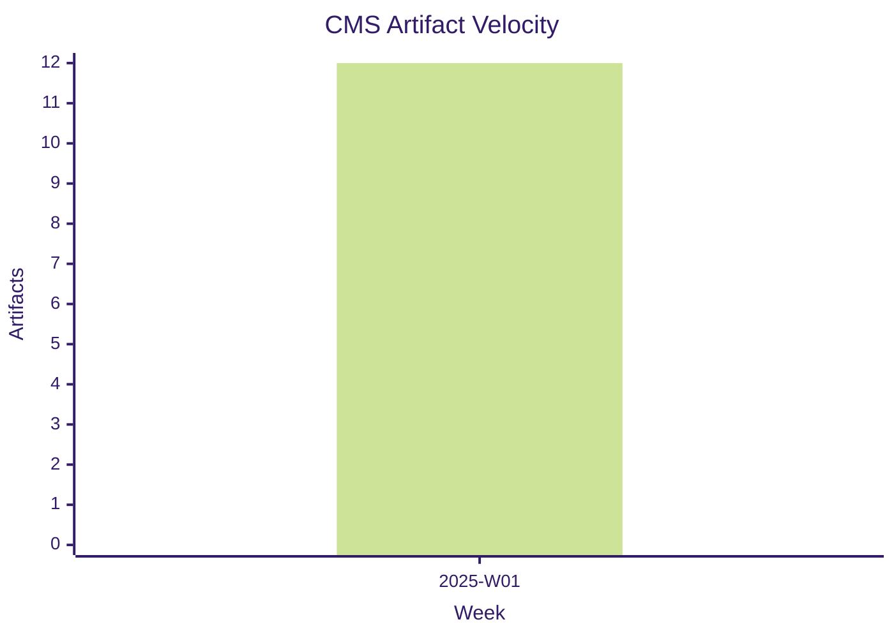
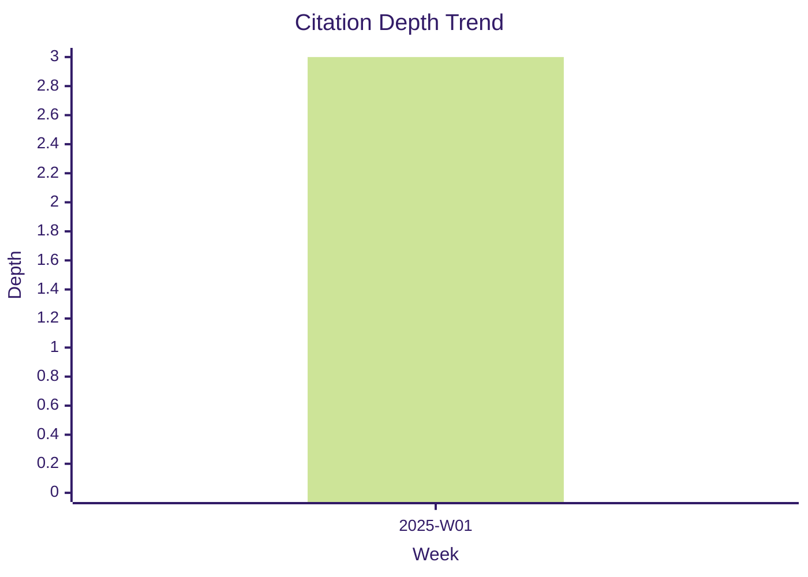

# Culture Analytics Weekly Report

This report summarises CMS metrics across the most recent culture snapshots.

**Week:** 2025-W01
**Generated:** 2025-01-12T18:00:00.000Z

| Metric | Value |
| --- | --- |
| Artifact Count | 12 |
| Citation Depth | 3.00 |
| Influence Dispersion (Gini) | 0.2100 |
| Reuse (Derivative Jobs) | 9 |

