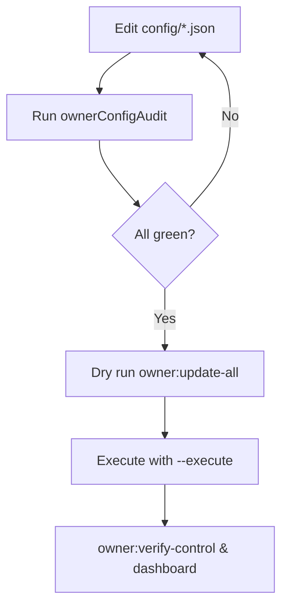

# Owner Configuration Audit

- Generated: `2025-10-02T18:50:29.333Z`
- Network context: `sepolia`
- Token config: `config/agialpha.sepolia.json` (sha256: `a6ce5c39468c7ad8445ee1f2007b588e648e049c36f5b8abca5c5329f0510286`)
- Owner control config: `config/owner-control.json` (sha256: `8e69e8923d19fcb111b3fdc631c25351ec54a987eb9518c47fd9a4609d9f5c6f`)
- Status totals: ✅ 0 · ⚠️ 9 · ❌ 10

## Module Overview

| Module | Owner | Governance | Token mapping | Config hashes | Notes |
| --- | --- | --- | --- | --- | --- |
| Stake Manager | n/a | ❌ (governance address missing) | ⚠️ 0x0000000000000000000000000000000000000000 (zero address placeholder) | `68bee81829…` | Governance target missing in owner-control config. Populate config/agialpha*.json → modules.stakeManager with the deployed address. |
| Fee Pool | ❌ (owner address missing) | n/a | ⚠️ 0x0000000000000000000000000000000000000000 (zero address placeholder) | `f5d10c0e1b…` | Owner address missing in owner-control config. Populate config/agialpha*.json → modules.feePool with the deployed address. |
| Job Registry | n/a | ❌ (governance address missing) | ⚠️ 0x0000000000000000000000000000000000000000 (zero address placeholder) | `c3d4b7a5c6…` | Governance target missing in owner-control config. Populate config/agialpha*.json → modules.jobRegistry with the deployed address. Loader failed: JobRegistry tax policy cannot be the zero address |
| Platform Registry | ❌ (owner address missing) | n/a | ⚠️ 0x0000000000000000000000000000000000000000 (zero address placeholder) | `8e734d8488…` | Owner address missing in owner-control config. Populate config/agialpha*.json → modules.platformRegistry with the deployed address. Loader failed: PlatformRegistry address cannot be the zero address |
| Platform Incentives | ❌ (owner address missing) | n/a | ⚠️ 0x0000000000000000000000000000000000000000 (zero address placeholder) | `3ebb65bac0…` | Owner address missing in owner-control config. Populate config/agialpha*.json → modules.platformIncentives with the deployed address. |
| Reward Engine | n/a | ❌ (governance address missing) | n/a | `09b97dd68d…` | Governance target missing in owner-control config. Loader failed: RewardEngine address cannot be the zero address |
| Thermostat | n/a | ❌ (governance address missing) | n/a | `9795c75be2…` | Governance target missing in owner-control config. Loader failed: RewardEngine address cannot be the zero address |
| Randao Coordinator | n/a | n/a | ⚠️ 0x0000000000000000000000000000000000000000 (zero address placeholder) | `45ab69627e…` | Module type not set in owner-control config; defaulting to optional checks. Populate config/agialpha*.json → modules.randaoCoordinator with the deployed address. |
| Energy Oracle | n/a | n/a | n/a | `ffdbf66ef2…` | Module type not set in owner-control config; defaulting to optional checks. |
| Tax Policy | ❌ (owner address missing) | n/a | ⚠️ 0x0000000000000000000000000000000000000000 (zero address placeholder) | `8faa30b198…` | Owner address missing in owner-control config. Populate config/agialpha*.json → modules.taxPolicy with the deployed address. |
| Identity Registry | ❌ (owner address missing) | n/a | ⚠️ 0x0000000000000000000000000000000000000000 (zero address placeholder) | `59f6948d06…` | Owner address missing in owner-control config. Populate config/agialpha*.json → modules.identityRegistry with the deployed address. |
| Hamiltonian Monitor | n/a | n/a | n/a | `82c0b685a7…` |  |
| System Pause | n/a | ❌ (governance address missing) | ⚠️ 0x0000000000000000000000000000000000000000 (zero address placeholder) | `8e69e8923d…` | Governance target missing in owner-control config. Populate config/agialpha*.json → modules.systemPause with the deployed address. |

## Detailed Guidance

### Stake Manager

Controls minimum stake levels, treasury routing, slashing weights and the auto-stake PID logic.

- **Owner-control type:** `governable`
- **Governance target:** ❌ (governance address missing)
- **Token mapping:** ⚠️ 0x0000000000000000000000000000000000000000 (zero address placeholder)
- **Configuration files:**
  - `config/stake-manager.json` (sha256: `68bee818297ad49f87027417234ffe4a2b5b94a2d71addcd6ef6262bcfbf024c`, 1341 bytes)
- **Update commands:**
  - `npm run owner:update-all -- --network <network> --only=stakeManager`
  - `npx hardhat run scripts/v2/updateStakeManager.ts --network <network>`
- **Verification commands:**
  - `npm run owner:verify-control -- --network <network> --modules=stakeManager`
  - `npm run owner:dashboard -- --network <network>`
- **Reference docs:**
  - [docs/stake-manager-configuration.md](../docs/stake-manager-configuration.md)
  - [docs/owner-control-handbook.md](../docs/owner-control-handbook.md)
- **Action items:**
  - Governance target missing in owner-control config.
  - Populate config/agialpha*.json → modules.stakeManager with the deployed address.

### Fee Pool

Burns protocol fees, routes the remainder to the treasury and tracks authorised reward distributors.

- **Owner-control type:** `ownable`
- **Owner target:** ❌ (owner address missing)
- **Token mapping:** ⚠️ 0x0000000000000000000000000000000000000000 (zero address placeholder)
- **Configuration files:**
  - `config/fee-pool.json` (sha256: `f5d10c0e1b256f0ed63a732823013d799d98a752459d9df35e2e1e822ea2520f`, 398 bytes)
- **Update commands:**
  - `npm run owner:update-all -- --network <network> --only=feePool`
  - `npx hardhat run scripts/v2/updateFeePool.ts --network <network>`
- **Verification commands:**
  - `npm run owner:verify-control -- --network <network> --modules=feePool`
  - `npm run owner:dashboard -- --network <network>`
- **Reference docs:**
  - [docs/fee-pool-operations.md](../docs/fee-pool-operations.md)
  - [docs/owner-control-command-center.md](../docs/owner-control-command-center.md)
- **Action items:**
  - Owner address missing in owner-control config.
  - Populate config/agialpha*.json → modules.feePool with the deployed address.

### Job Registry

Defines job stakes, validator rewards, fee percentages and registry integrations.

- **Owner-control type:** `governable`
- **Governance target:** ❌ (governance address missing)
- **Token mapping:** ⚠️ 0x0000000000000000000000000000000000000000 (zero address placeholder)
- **Configuration files:**
  - `config/job-registry.json` (sha256: `c3d4b7a5c68e4ebd5886dbab6715a6e8a56d09569e70abf70488c433d03b747f`, 387 bytes)
- **Update commands:**
  - `npm run owner:update-all -- --network <network> --only=jobRegistry`
  - `npx hardhat run scripts/v2/updateJobRegistry.ts --network <network>`
- **Verification commands:**
  - `npm run owner:verify-control -- --network <network> --modules=jobRegistry`
  - `npm run owner:dashboard -- --network <network>`
- **Reference docs:**
  - [docs/job-registry-configuration.md](../docs/job-registry-configuration.md)
  - [docs/owner-control-playbook.md](../docs/owner-control-playbook.md)
- **Action items:**
  - Governance target missing in owner-control config.
  - Populate config/agialpha*.json → modules.jobRegistry with the deployed address.
  - Loader failed: JobRegistry tax policy cannot be the zero address

### Platform Registry

Records approved operators and pausers, plus the minimum stake for third-party platforms.

- **Owner-control type:** `ownable`
- **Owner target:** ❌ (owner address missing)
- **Token mapping:** ⚠️ 0x0000000000000000000000000000000000000000 (zero address placeholder)
- **Configuration files:**
  - `config/platform-registry.json` (sha256: `8e734d8488e396d905cccd0cc37f444aa761c129b0b7a212fcf702a47e1f478a`, 324 bytes)
- **Update commands:**
  - `npm run owner:update-all -- --network <network> --only=platformRegistry`
  - `npx hardhat run scripts/v2/updatePlatformRegistry.ts --network <network>`
- **Verification commands:**
  - `npm run owner:verify-control -- --network <network> --modules=platformRegistry`
  - `npm run owner:dashboard -- --network <network>`
- **Reference docs:**
  - [docs/platform-registry-operations.md](../docs/platform-registry-operations.md)
  - [docs/owner-control-visual-guide.md](../docs/owner-control-visual-guide.md)
- **Action items:**
  - Owner address missing in owner-control config.
  - Populate config/agialpha*.json → modules.platformRegistry with the deployed address.
  - Loader failed: PlatformRegistry address cannot be the zero address

### Platform Incentives

Controls the job router link and maximum discount percentage for approved platforms.

- **Owner-control type:** `ownable`
- **Owner target:** ❌ (owner address missing)
- **Token mapping:** ⚠️ 0x0000000000000000000000000000000000000000 (zero address placeholder)
- **Configuration files:**
  - `config/platform-incentives.json` (sha256: `3ebb65bac0d998af6454f4003a21ee0ebbb39c7a099fd1b11e1eb617404ff4ac`, 220 bytes)
- **Update commands:**
  - `npm run owner:update-all -- --network <network> --only=platformIncentives`
  - `npx hardhat run scripts/v2/updatePlatformIncentives.ts --network <network>`
- **Verification commands:**
  - `npm run owner:verify-control -- --network <network> --modules=platformIncentives`
  - `npm run owner:dashboard -- --network <network>`
- **Reference docs:**
  - [docs/platform-registry-operations.md](../docs/platform-registry-operations.md)
  - [docs/owner-control-operations.md](../docs/owner-control-operations.md)
- **Action items:**
  - Owner address missing in owner-control config.
  - Populate config/agialpha*.json → modules.platformIncentives with the deployed address.

### Reward Engine

Distributes the thermodynamic reward pool across agents, validators, operators and employers.

- **Owner-control type:** `governable`
- **Governance target:** ❌ (governance address missing)
- **Configuration files:**
  - `config/reward-engine.json` (sha256: `09b97dd68df29363a50a4a6621ea7f065f0555011dd524920ad169499cd78cf1`, 599 bytes)
- **Update commands:**
  - `npm run owner:update-all -- --network <network> --only=rewardEngine`
  - `npx hardhat run scripts/v2/updateRewardEngine.ts --network <network>`
- **Verification commands:**
  - `npm run owner:verify-control -- --network <network> --modules=rewardEngine`
  - `npm run owner:dashboard -- --network <network>`
- **Reference docs:**
  - [docs/thermodynamics-operations.md](../docs/thermodynamics-operations.md)
  - [docs/owner-control-blueprint.md](../docs/owner-control-blueprint.md)
- **Action items:**
  - Governance target missing in owner-control config.
  - Loader failed: RewardEngine address cannot be the zero address

### Thermostat

Adjusts system temperature via PID gains, temperature bounds and KPI weights.

- **Owner-control type:** `governable`
- **Governance target:** ❌ (governance address missing)
- **Configuration files:**
  - `config/thermodynamics.json` (sha256: `9795c75be2eb5ca189e89d69374fbc935f0da05e9f00be8245e7b0de9a230b65`, 1187 bytes)
- **Update commands:**
  - `npm run owner:update-all -- --network <network> --only=thermostat`
  - `npx hardhat run scripts/v2/updateThermostat.ts --network <network>`
  - `npx hardhat run scripts/v2/updateThermodynamics.ts --network <network>`
- **Verification commands:**
  - `npm run owner:verify-control -- --network <network> --modules=thermostat`
  - `npm run owner:dashboard -- --network <network>`
- **Reference docs:**
  - [docs/thermodynamics-operations.md](../docs/thermodynamics-operations.md)
  - [docs/owner-control-zero-downtime-guide.md](../docs/owner-control-zero-downtime-guide.md)
- **Action items:**
  - Governance target missing in owner-control config.
  - Loader failed: RewardEngine address cannot be the zero address

### Randao Coordinator

Maintains commit/reveal windows and validator deposit requirements for randomness beacons.

- **Token mapping:** ⚠️ 0x0000000000000000000000000000000000000000 (zero address placeholder)
- **Configuration files:**
  - `config/randao-coordinator.json` (sha256: `45ab69627e3df31c82e749d25f3c901fa0b90d50c66327c6bbb36f74720bc278`, 172 bytes)
- **Update commands:**
  - `npm run owner:update-all -- --network <network> --only=randaoCoordinator`
  - `npx hardhat run scripts/v2/updateRandaoCoordinator.ts --network <network>`
- **Verification commands:**
  - `npm run owner:verify-control -- --network <network> --modules=randaoCoordinator`
  - `npm run owner:dashboard -- --network <network>`
- **Reference docs:**
  - [docs/owner-control-command-center.md](../docs/owner-control-command-center.md)
  - [docs/owner-control-quick-reference.md](../docs/owner-control-quick-reference.md)
- **Action items:**
  - Module type not set in owner-control config; defaulting to optional checks.
  - Populate config/agialpha*.json → modules.randaoCoordinator with the deployed address.

### Energy Oracle

Registers authorised measurement nodes responsible for signing energy attestations.

- **Configuration files:**
  - `config/energy-oracle.json` (sha256: `ffdbf66ef28d1c185bd49e69881a97d68e4e74f15d03fe9a5715a1c2bd5c3db8`, 45 bytes)
- **Update commands:**
  - `npm run owner:update-all -- --network <network> --only=energyOracle`
  - `npx hardhat run scripts/v2/updateEnergyOracle.ts --network <network>`
- **Verification commands:**
  - `npm run owner:verify-control -- --network <network> --modules=energyOracle`
  - `npm run owner:dashboard -- --network <network>`
- **Reference docs:**
  - [docs/thermodynamics-operations.md](../docs/thermodynamics-operations.md)
  - [docs/owner-control-mission.md](../docs/owner-control-mission.md)
- **Action items:**
  - Module type not set in owner-control config; defaulting to optional checks.

### Tax Policy

Publishes the canonical tax acknowledgement text and authorised signers.

- **Owner-control type:** `ownable2step`
- **Owner target:** ❌ (owner address missing)
- **Token mapping:** ⚠️ 0x0000000000000000000000000000000000000000 (zero address placeholder)
- **Configuration files:**
  - `config/tax-policy.json` (sha256: `8faa30b19850f5889f3011620c648bd66ed830c4ea69c7067b98eb6c2b3fffc2`, 213 bytes)
- **Update commands:**
  - `npm run owner:update-all -- --network <network> --only=taxPolicy`
  - `npx hardhat run scripts/v2/updateTaxPolicy.ts --network <network>`
- **Verification commands:**
  - `npm run owner:verify-control -- --network <network> --modules=taxPolicy`
- **Reference docs:**
  - [docs/owner-control-handbook.md](../docs/owner-control-handbook.md)
  - [docs/owner-control-playbook.md](../docs/owner-control-playbook.md)
- **Action items:**
  - Owner address missing in owner-control config.
  - Populate config/agialpha*.json → modules.taxPolicy with the deployed address.

### Identity Registry

Maintains ENS roots, Merkle proofs and emergency allowlists for agents and validators.

- **Owner-control type:** `ownable2step`
- **Owner target:** ❌ (owner address missing)
- **Token mapping:** ⚠️ 0x0000000000000000000000000000000000000000 (zero address placeholder)
- **Configuration files:**
  - `config/identity-registry.json` (sha256: `59f6948d063091e8ee6d4ed3ea90ef321c89c0044ac26ad027f5ab2b34969aae`, 696 bytes)
- **Update commands:**
  - `npm run owner:update-all -- --network <network> --only=identityRegistry`
  - `npx hardhat run scripts/v2/updateIdentityRegistry.ts --network <network>`
- **Verification commands:**
  - `npm run owner:verify-control -- --network <network> --modules=identityRegistry`
  - `npm run identity:update -- --network <network>`
- **Reference docs:**
  - [docs/ens-identity-policy.md](../docs/ens-identity-policy.md)
  - [docs/owner-control-command-center.md](../docs/owner-control-command-center.md)
- **Action items:**
  - Owner address missing in owner-control config.
  - Populate config/agialpha*.json → modules.identityRegistry with the deployed address.

### Hamiltonian Monitor

Tracks Hamiltonian metrics for auto-stake tuning and thermodynamic telemetry.

- **Configuration files:**
  - `config/hamiltonian-monitor.json` (sha256: `82c0b685a76108b79530d80ccb5b6c60c727ba3b71d5c1effccaa37fc9b0ffad`, 121 bytes)
- **Update commands:**
  - `npx hardhat run scripts/v2/updateHamiltonianMonitor.ts --network <network>`
- **Verification commands:**
  - `npm run owner:dashboard -- --network <network>`
- **Reference docs:**
  - [docs/thermodynamics-operations.md](../docs/thermodynamics-operations.md)
  - [docs/owner-control-operations.md](../docs/owner-control-operations.md)

### System Pause

Co-ordinates emergency pausing for all modules and validates ownership wiring.

- **Owner-control type:** `governable`
- **Governance target:** ❌ (governance address missing)
- **Token mapping:** ⚠️ 0x0000000000000000000000000000000000000000 (zero address placeholder)
- **Configuration files:**
  - `config/owner-control.json` (sha256: `8e69e8923d19fcb111b3fdc631c25351ec54a987eb9518c47fd9a4609d9f5c6f`, 1091 bytes)
- **Update commands:**
  - `npx hardhat run scripts/v2/updateSystemPause.ts --network <network>`
- **Verification commands:**
  - `npm run owner:verify-control -- --network <network> --modules=systemPause`
- **Reference docs:**
  - [docs/owner-control-zero-downtime-guide.md](../docs/owner-control-zero-downtime-guide.md)
  - [docs/owner-control-command-center.md](../docs/owner-control-command-center.md)
- **Action items:**
  - Governance target missing in owner-control config.
  - Populate config/agialpha*.json → modules.systemPause with the deployed address.
