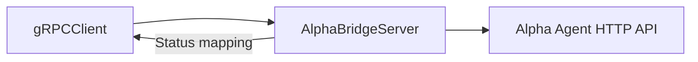

# AGI Jobs v0 (v2) — Alpha Bridge gRPC Proxy

[](https://github.com/MontrealAI/AGIJobsv0/actions/workflows/ci.yml)
[](https://github.com/MontrealAI/AGIJobsv0/actions/workflows/containers.yml)

Alpha Bridge exposes a gRPC façade for the Alpha agent HTTP API. It normalises metadata headers, streams plan requests, and maps
HTTP errors to canonical gRPC status codes so orchestrators and validators can integrate through a single binary interface.

## Service behaviour

- Loads the protobuf definition from `proto/alpha_bridge.proto` and publishes the `AlphaBridge` service via `@grpc/grpc-js`.【F:services/alpha-bridge/src/server.js†L1-L40】
- Accepts plan requests, history payloads, and metadata, forwarding them to the configured HTTP endpoint while preserving trace
  headers and consent flags.【F:services/alpha-bridge/src/server.js†L41-L140】
- Converts HTTP error responses into gRPC statuses using an explicit map (400→INVALID_ARGUMENT, 503→UNAVAILABLE, etc.).【F:services/alpha-bridge/src/server.js†L19-L70】
- Provides helper utilities for JSON parsing, metadata normalisation, and header projection to keep the adapter deterministic.



## Running locally

```bash
cd services/alpha-bridge
npm install
node src/server.js
```

Set `ALPHA_AGENT_URL` to point the proxy at your Alpha agent deployment. Use `grpcurl` to test the bridge:

```bash
grpcurl -plaintext -d '{"utterance":"summarise the job"}' localhost:50051 agi.alpha.bridge.v1.AlphaBridge/Plan
```

## Docker image

The root `containers.yml` workflow builds and scans the accompanying Dockerfile. To run locally:

```bash
docker build -t alpha-bridge .
docker run --rm -p 50051:50051 -e ALPHA_AGENT_URL=https://alpha-agent alpha-bridge
```

This proxy keeps the superintelligent machine’s orchestration stack accessible to gRPC clients while retaining owner-level control
over metadata, consent flags, and error handling.
