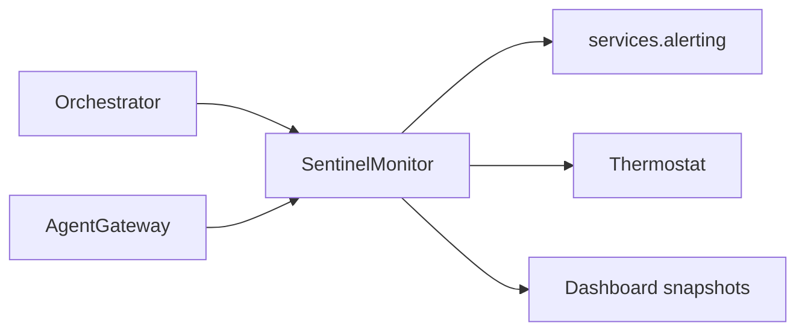

# AGI Jobs v0 (v2) — Sentinel Monitor

[](https://github.com/MontrealAI/AGIJobsv0/actions/workflows/ci.yml)
[](https://github.com/MontrealAI/AGIJobsv0/actions/workflows/ci.yml)

The sentinel service enforces guardrails around the Higher Governance Machine. It listens to expansion/evaluation events, tracks
ROI, prunes risky agents, and emits alerts when owner intervention is required. The agent gateway and orchestrator feed events into
this monitor during CI and production runs.

## Components

- **`service.py`** – Defines `SentinelMonitor`, an asyncio-driven event processor that consumes expansion/evaluation events, keeps
  ROI totals, manages pause reasons, and exposes a `snapshot()` for dashboards.【F:services/sentinel/service.py†L1-L160】
- **`config.py`** – `SentinelConfig` dataclass describing thresholds (ROI caps, pause windows, max failures).【F:services/sentinel/config.py†L1-L160】
- **`tests/`** – Pytest suite verifying pruning, ROI thresholds, and alert emission.

## Event flow



## Usage

```python
from services.sentinel.service import SentinelMonitor
from hgm_core.engine import HGMEngine
from services.sentinel.config import SentinelConfig

monitor = SentinelMonitor(engine=HGMEngine(), config=SentinelConfig())
await monitor.observe_expansion("mission/alpha", {"score": 0.8})
await monitor.observe_evaluation("mission/alpha", {"reward": 1.2})
snapshot = monitor.snapshot()
```

The sentinel integrates with the thermostat and orchestrator to request pauses when ROI dips below the configured thresholds. CI v2
runs these tests in `ci (v2) / Python unit tests` and the `HGM guardrails` job, guaranteeing the contract owner retains immediate
control when anomalies arise.【F:.github/workflows/ci.yml†L118-L349】【F:.github/workflows/ci.yml†L350-L439】

Keep the sentinel thresholds aligned with owner policy so the superintelligent machine flags anomalies before they impact mission
outcomes.
