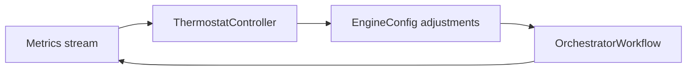

# AGI Jobs v0 (v2) — Thermostat Service

[](https://github.com/MontrealAI/AGIJobsv0/actions/workflows/ci.yml)
[](https://github.com/MontrealAI/AGIJobsv0/actions/workflows/ci.yml)

The thermostat keeps the Higher Governance Machine within owner-defined ROI bands. It consumes streaming metrics, adjusts HGM
widening/Thompson parameters, and surfaces adjustments back to the orchestrator. Owners can tune the guardrails via `config/agialpha/`
without changing code.

## Core modules

- **`controller.py`** – Implements `ThermostatController`, a feedback loop that ingests ROI samples, enforces cooldown windows, and
  adjusts widening/Thompson parameters when ROI drifts outside the permitted margins.【F:services/thermostat/controller.py†L1-L160】
- **`metrics.py`** – Defines the `MetricSample` dataclass and helpers for computing ROI snapshots delivered from orchestrator
  workflows.【F:services/thermostat/metrics.py†L1-L160】
- **`tests/`** – Pytest suite covering controller edge cases (cooldowns, boundary enforcement, concurrent updates).



## Configuration

Thermostat defaults live in `config/agialpha/thermostat.json`. CI regenerates the owner parameter matrix and fails if values fall
outside safety thresholds, guaranteeing the contract owner can adjust targets at any time.【F:.github/workflows/ci.yml†L393-L439】

Key knobs:

- `target_roi` – Desired return-on-investment.
- `lower_margin` / `upper_margin` – Permitted drift before adjustments trigger.
- `widening_step` / `thompson_step` – Incremental adjustments applied to the HGM engine.

## Local usage

```python
from services.thermostat.controller import ThermostatController, ThermostatConfig
from orchestrator.workflows.hgm import HGMOrchestrationWorkflow

controller = ThermostatController(workflow=workflow, config=ThermostatConfig())
await controller.initialize()
await controller.ingest(sample)  # sample is services.thermostat.metrics.MetricSample
```

CI v2 executes these tests as part of `ci (v2) / Python unit tests`, and the load-simulation job verifies ROI behaviour across
Monte Carlo sweeps.【F:.github/workflows/ci.yml†L118-L349】【F:.github/workflows/ci.yml†L216-L292】

Keep the thermostat aligned with owner requirements so mission owners can operate the superintelligent machine with predictable
financial outcomes.
